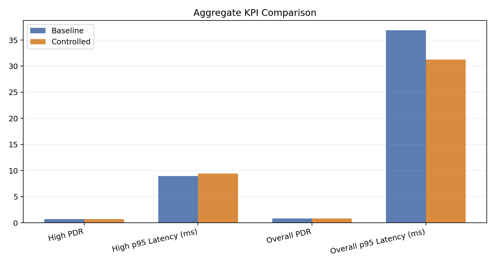
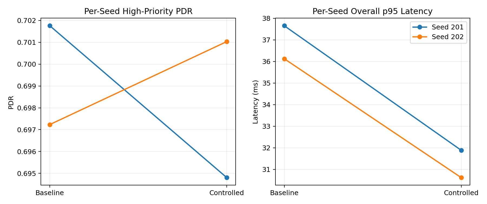
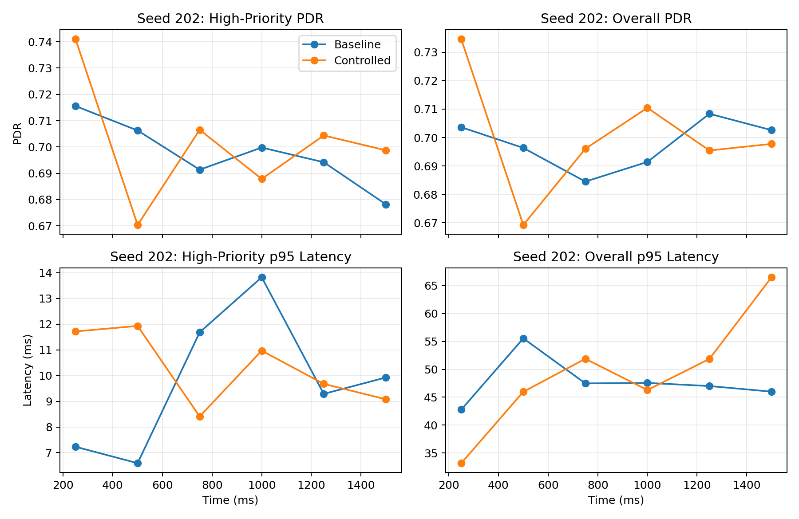
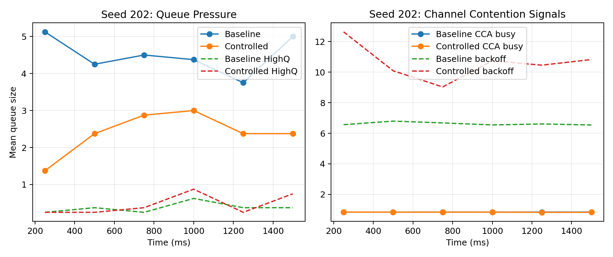
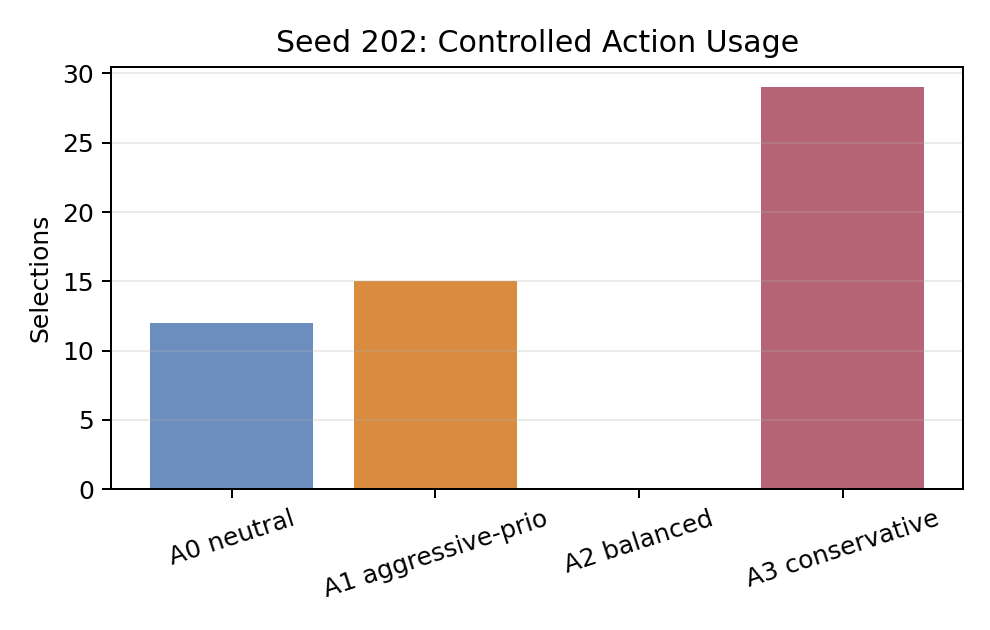

# PIN Local Overlay Demo Results

## Run Summary
- Scenario: 8 nodes, CSMA, 1.5 s, 150 m area, queue size 6.
- Traffic classes: command `0.15`, voice `0.25`, best-effort `0.60`.
- Control mode: local per-radio PIN overlay, action update every `250 ms`.
- Action space: 4 templates (`neutral`, `aggressive-priority`, `balanced`, `conservative`).
- Training: 2 episodes (seeds `10000`, `10001`).
- Evaluation: seeded A/B on seeds `201`, `202`.

Raw metrics JSON: [`pin_demo_metrics.json`](pin_demo_metrics.json)

## Aggregate A/B Results
| KPI | Baseline mean | Controlled mean | Delta (controlled - baseline) |
| --- | ---: | ---: | ---: |
| High-priority PDR | 0.6995 | 0.6979 | -0.0016 |
| High-priority p95 latency (ms) | 8.9836 | 9.4497 | +0.4662 |
| Overall PDR | 0.8193 | 0.8270 | +0.0077 |
| Overall p95 latency (ms) | 36.8898 | 31.2521 | -5.6377 |

Interpretation:
- The local controller improved overall reliability and reduced overall latency tail.
- High-priority latency and high-priority mean PDR did not improve on average in this small 2-seed run.

## Visual Comparison




## Specific Improvement Scenario (Seed 202)
This seed was selected as the highlight scenario because it had the strongest combined high-priority PDR gain and overall latency reduction.

| KPI | Baseline | Controlled | Delta |
| --- | ---: | ---: | ---: |
| High-priority PDR | 0.6972 | 0.7010 | +0.0038 |
| High-priority p95 latency (ms) | 9.3991 | 9.6750 | +0.2758 |
| Overall PDR | 0.8230 | 0.8398 | +0.0169 |
| Overall p95 latency (ms) | 36.1259 | 30.6193 | -5.5065 |

### Why the control helped in this seed
- In the first 250 ms interval, control improved both PDR metrics and reduced overall p95 latency:
- High-priority PDR delta: `+0.0255`
- Overall PDR delta: `+0.0310`
- Overall p95 latency delta: `-9.5849 ms`
- Best-effort queue mean delta: `-3.75` packets
- Mean backoff delta: `+6.07`
- Best-effort drops delta: `+468`

Mechanism interpretation:
- The local policy limited best-effort pressure and increased contention conservatism, which reduced queue pressure and protected channel time for higher-value traffic.
- This improved overall delivery and tail latency in the highlighted scenario, at the cost of more best-effort packet shedding.

### Highlight Visuals






## Reproduction
From repository root:

```bash
python3 radio-sim/experiments/pin_csma_demo.py
MPLCONFIGDIR=/tmp/mpl python3 radio-sim/experiments/generate_pin_demo_visuals.py
```
