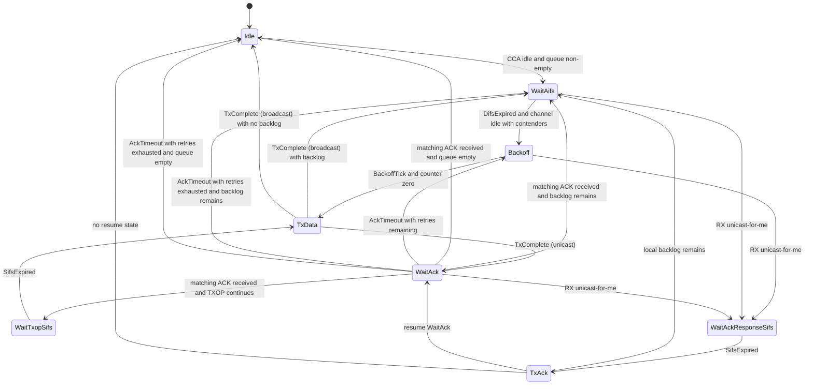
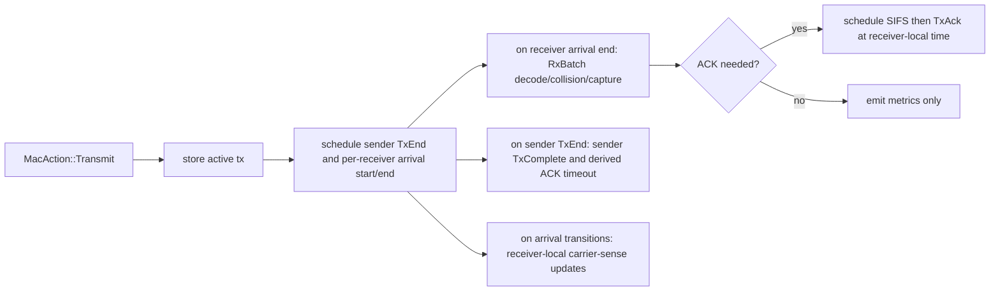
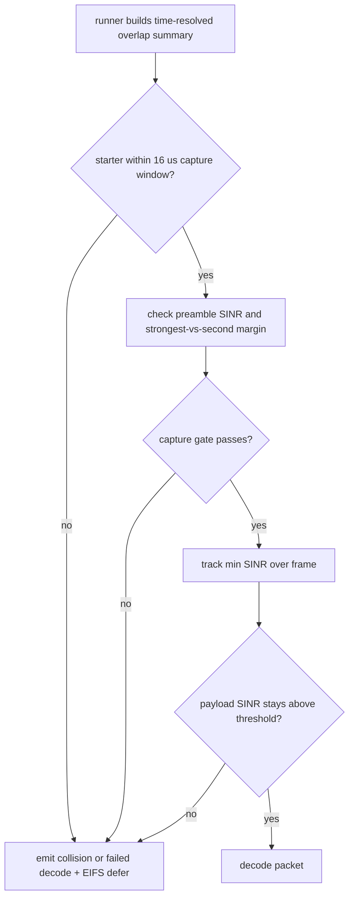

# CSMA/CA MAC Deep Dive

This page documents the concrete CSMA/CA behavior in `radio-sim`.

Implementation roots:

- `crates/radio-sim-core/src/mac/csma/csma_mac.rs`
- `crates/radio-sim-core/src/mac/csma/backoff.rs`
- `crates/radio-sim-core/src/sim/runner.rs` (deferred delivery integration)

## Core Model

- Access mode is event-driven DCF-style CSMA/CA with DIFS/SIFS/backoff timers.
- Sender completion happens at `TxEnd`, while receive completion happens at receiver-local arrival end after propagation.
- ACK semantics are explicit for unicast, with timeout/retry/drop handling.
- Successful broadcast completion, ACK completion, and ACK reply completion all immediately restart contention if backlog remains.

## State Machine

Notes:

- `Rx` enum variant exists but is not currently used as a durable state.
- Event ordering is deterministic via DES priority ordering.
- Packets enqueued while a node is already in `WaitAifs` or `Backoff` can join the current contention cycle on their own AIFS boundary; they do not wait for a future busy->idle transition.

## Deferred Delivery Lifecycle

Why this matters:

- Decode is evaluated from a time-resolved overlap history at each receiver, not a transmitter-time snapshot.
- ACK timing aligns with receiver-local data completion plus propagation, not immediate TX start.
- Carrier sense also follows receiver-local arrival timing rather than transmitter-local airtime.

## Queueing and Access Categories

Packet priority derives from packet kind defaults:

- `Ack=5`, `Command=4`, `Voice/Br*=3`, `Video=2`, `Data/Telemetry=1`, `Bulk=0`.

Packets are mapped into public EDCA access categories:

- `VO`: `Voice`, `Command`, `Brq`, `Bex`, `Bsc`
- `VI`: `Video`
- `BE`: `Data`, `Telemetry`
- `BK`: `Bulk`

Each node maintains one FIFO queue and one EDCAF contender per access category. Contention is not driven by one scored global queue anymore. It is driven by:

- per-AC AIFS eligibility derived from the current effective EDCA parameters
- per-AC CWmin/CWmax
- per-AC backoff stage and counter
- per-AC TXOP limit
- internal collision resolution when multiple ACs reach zero together inside the same node

Admission behavior:

- Hard cap: `node_queue_size` across the node's aggregate queued packets
- FIFO insertion within each access-category queue

## Local Control Surface

A PIN/RL controller running alongside each radio applies a `LocalAction` per node every observation interval and reads a `LocalObservation` of the local MAC and queue state. The CSMA control surface covers six action axes and seven observation axes; together they let the controller bias contention, manipulate the queue, shape source traffic, and tune PHY-level parameters from a local view.

For the controller-side runtime contract (Python API, sequence diagram, and end-to-end loop), see [PIN Controller API](pin_controller_api.md). For the MARL framing, reward, and broader sensing model, see [PIN MARL Formulation](pin_marl_formulation.md).

### Action axes

All actions are per-node. Per-AC actions carry one value per `VO / VI / BE / BK`. Deltas apply around the configured EDCA baseline; absolute fields override the live setting.

1. **EDCA tuning, per access category.**
    - `aifsn_delta[ac]` — bias access urgency on the next eligibility recomputation. Bound: effective `AIFSN >= 1`.
    - `cw_min_exp_delta[ac]` — bias the initial contention window (`CWmin = 2^cw_min_exp`). Bound: effective exponent in `[1, 12]`.
    - `cw_max_exp_delta[ac]` — bias the maximum contention window (`CWmax = 2^cw_max_exp`). Bound: effective exponent in `[1, 12]` and `CWmax >= CWmin`.
    - `txop_limit_us_delta[ac]` — bias the bounded TXOP continuation budget. Bound: effective `TXOP >= 0`.
2. **Queue management, per access category.**
    - `purge_oldest[ac]` — drop the N oldest packets from this AC's queue (active aging).
    - `purge_older_than_ms[ac]` — drop packets whose head-of-line age exceeds the threshold (deadline-based pruning).
    - `head_bypass[ac]` — temporarily allow a higher-priority packet to leapfrog FIFO order within the AC.
3. **Admission control, per access category.**
    - `max_queue_len[ac]` — runtime per-AC queue cap; overrides the global `node_queue_size`.
    - `rate_cap_pps[ac]` — token-bucket emit-rate ceiling for new arrivals into this AC.
4. **Stream-level controls (cross-cuts AC).**
    - `pause_stream[stream_id]` / `resume_stream[stream_id]` — block enqueue for a flow without dropping queued packets.
    - `drop_stream[stream_id]` — flush a flow from the queue.
    - `reclassify_stream[stream_id, target_ac]` — promote or demote a flow's AC mapping (e.g., move a Voice talkgroup to BE under congestion).
5. **PHY tuning, per node (slow-cadence).**
    - `tx_power_w` — adjust transmit power; affects topology and interference.
    - `mcs_lock[ac]` — pin a data-rate ceiling for this AC; suppresses rate-adaptation oscillation.
6. **Routing and topology, per node.**
    - `neighbor_blacklist`, `link_cost_override[neighbor_id]`, `next_hop_pref[dest_id]` — bias the per-radio routing table. CSMA today is single-hop; these fields are part of the design and become live alongside a multi-hop CSMA routing layer.

### Observation axes

`get_local_observations()` returns one `LocalObservation` per node every control interval. All per-AC fields are dictionaries keyed by `vo / vi / be / bk`. Counters are interval deltas over the observation window.

1. **Per-AC queue state.** `queue_len`, `head_of_line_age_ns`, `retry_count` (head packet).
2. **Per-AC backoff state.** `backoff_stage`, `backoff_slots`, `current_cw_exp`.
3. **Per-AC interval counters (sender-local).** `tx_attempts`, `tx_success`, `retries`, `ack_timeouts`, `drops`, `internal_collisions`, `txop_grants`, `txop_uses`.
4. **Per-AC interval delivery (destination-side).** `deliveries`, `p95_latency_ns`.
5. **Node-level.** `collisions`, `cca_busy_fraction`, `mean_backoff_slots`.
6. **Stream-level.** `streams_present[stream_id]` — flows currently holding queued packets at this node. Lets the agent target stream-level actions without scanning every packet.
7. **Topology hints.** `neighbor_rssi_dbm[neighbor_id]` and `link_pdr[neighbor_id]` summarized over the observation interval. Lets the agent reason about which neighbors are reachable without a full routing table.

A sender-centric reward should not assume every field has identical sender/receiver semantics. `tx_attempts`, `tx_success`, `retries`, `ack_timeouts`, and `drops` are node-local MAC interval counters; `deliveries` and `p95_latency_ns` summarize destination-side delivery for that node.

### Implementation status

What currently ships:

- Action axes 1–4 (EDCA tuning, queue management, admission control, stream-level controls) are wired in `crates/radio-sim-core/src/mac/csma/csma_mac.rs::apply_local_action` and `enqueue`. Each agent-induced drop emits a `MetricEvent::Drop` with a reason like `agent_purge_oldest`, `agent_purge_older_than`, or `agent_drop_stream`.
- Observation axes 1–6 are populated in `crates/radio-sim-core/src/sim/runner.rs::take_local_observations` and surfaced via `crates/radio-sim-py/src/sim.rs::get_local_observations`. Axis 6 is the `streams_present` list of stream IDs currently queued.
- Per-axis action-outcome counters (`action_outcomes.purged_oldest`, `admission_drops`, `rate_cap_drops`, `stream_paused_drops`, `stream_flush_drops`, `stream_reclassifications`) appear in every observation as interval deltas — the agent's feedback that its actions took effect.
- The Python `apply_local_actions` parser accepts partial action dicts: missing keys leave that axis at its no-op default. Useful when an agent only wants to set one axis per tick.

Being built:

- Action axis 5 (PHY tuning: `tx_power_w`, `mcs_lock`).
- Action axis 6 (routing and topology) waits on the multi-hop CSMA routing layer.
- Observation axis 7 (topology hints: `neighbor_rssi_dbm`, `link_pdr`).

Baseline guarantee: when `control_overlay.enabled = false`, the runtime never calls `apply_local_action`, so the radio behaves exactly as the baseline emulator. When the overlay is enabled but the controller sends `LocalAction::default()`, the result is byte-identical to the disabled-overlay baseline (pinned by the `overlay_silent_matches_baseline` integration test).

This is the canonical naming for action and observation fields; the controller API and MARL formulation pages reference these names without restating them.

## Collision and Capture

Key points:

- CSMA receive success is evaluated over overlap segments, not from a single end-of-frame interference snapshot.
- Arrivals must first clear `rx_sensitivity_dbm` to become packet candidates at all.
- Among packet candidates, preamble detect uses `preamble_detect_sinr_db` and payload decode uses `payload_decode_sinr_db`.
- Energy that stays below `rx_sensitivity_dbm` can still contribute interference and CCA energy, but it never becomes a decodable packet and never triggers EIFS by itself.
- A later packet may capture only if it starts within the 16 us acquisition window and beats the current starter by `capture_margin_db` while meeting the preamble SINR gate.
- Later packets outside that window only contribute interference; they do not become decodable replacements.
- Half-duplex guard: any overlap between a node's own transmit interval and a received frame blocks decode for that frame.
- EIFS is derived from `SIFS + ACK airtime + AIFS(BE)` and enforced as a minimum `access_not_before` gate over future queue eligibility.

## Timers and Runtime Semantics

Important timers/events:

- `DifsExpired` (used as the node-level access-eligibility check)
- `BackoffTick`
- `TxEnd`
- `SignalArrivalStart`
- `SignalArrivalEnd`
- `RxBatch`
- `CarrierSenseUpdate`
- `AckTimeout`
- `SifsExpired` (for ACK send and TXOP continuation)
- `CcaSample` (telemetry sampling, not the primary busy/idle mechanism)

Runtime notes:

- EDCA backoff counters that are already zero at a slot boundary may transmit immediately.
- Counters that become zero because of the current `BackoffTick` wait until the next idle slot boundary before transmitting.
- `BackoffTick` also arms any AC whose AIFS has just expired, so later-AIFS contenders can join an already-running backoff round.
- TXOP continuation admission uses full exchange time for unicast (`data + SIFS + ACK airtime`) and `data + SIFS` for broadcast.

`run_until_ms` is absolute-time stepping; caller controls cadence.

## Configuration Surface

Primary CSMA knobs (core config):

- `slot_duration_us`, `sifs_us`
- `cca_threshold_dbm`
- `edca.vo`, `edca.vi`, `edca.be`, `edca.bk`
- `ack_timeout_us`, `max_retries`, `ack_bits`
- `data_rate_bps`, `control_rate_bps`, `preamble_us`
- `rx_sensitivity_dbm`, `preamble_detect_sinr_db`, `payload_decode_sinr_db`
- `capture_margin_db`
- `node_queue_size`

Notable constraint:

- `enable_rts_cts = true` is currently rejected by validation.
- `ack_timeout_us` is extra slack margin on top of the derived minimum wait for `data tail propagation + SIFS + ACK airtime + reverse propagation`.
- `control_rate_bps` defaults to `data_rate_bps` when unset.
- `rx_sensitivity_dbm` defaults to `cca_threshold_dbm` when unset.
- `preamble_detect_sinr_db` defaults to `payload_decode_sinr_db`, and `payload_decode_sinr_db` defaults to `4 dB`.

## Known Gotchas

- Non-media broadcast traffic can yield RX without delivery semantics expected by delivery KPIs.
- Some enqueue drops due to admission threshold are currently surfaced with generic `queue_full` drop reason in runner-level metrics.
- Python setters expose only a subset of CSMA knobs; advanced tuning may require TOML via `SimConfig.from_toml(...)`.
