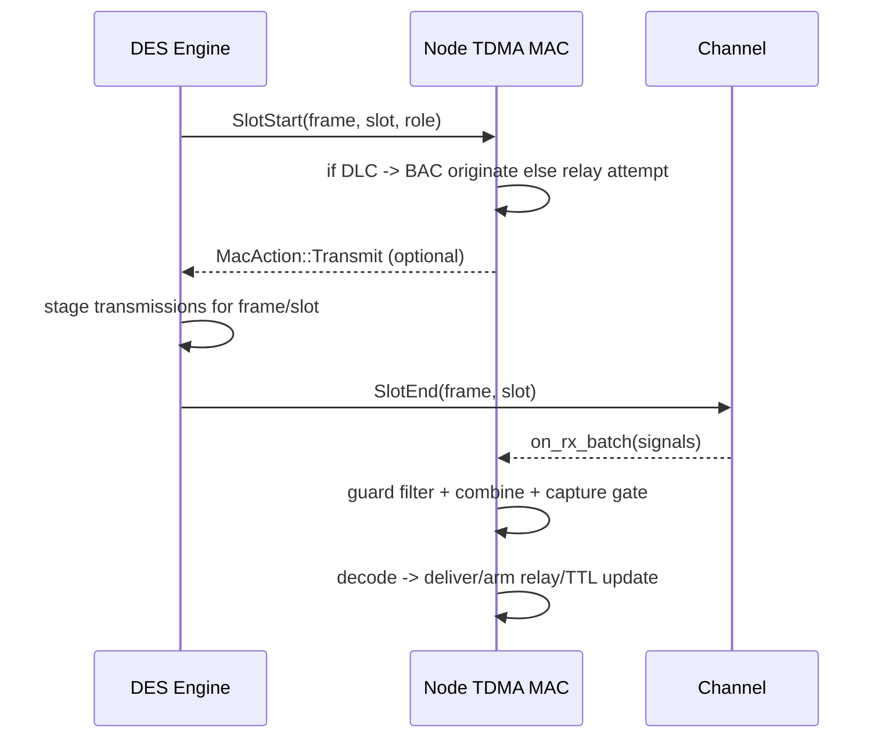
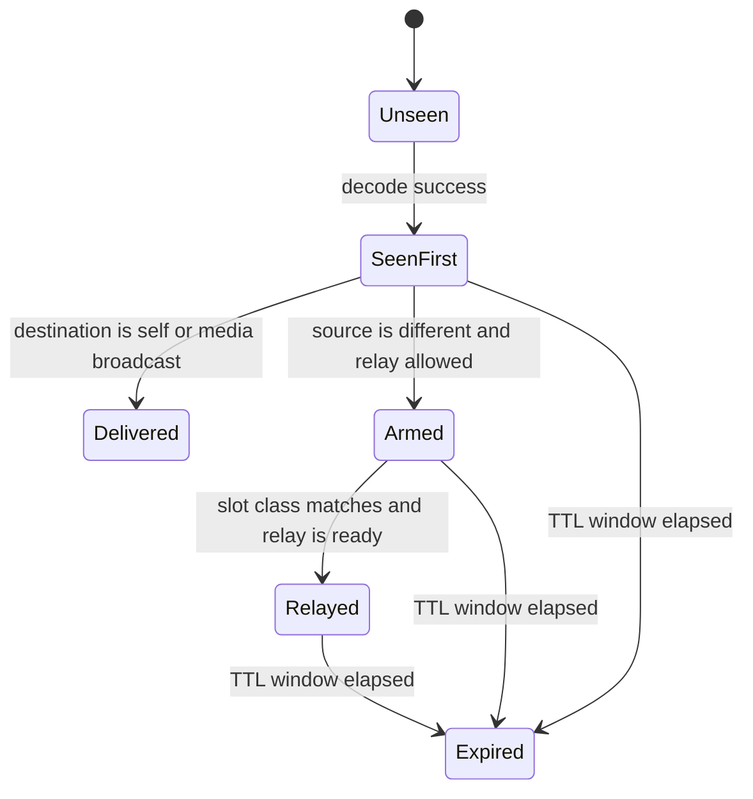
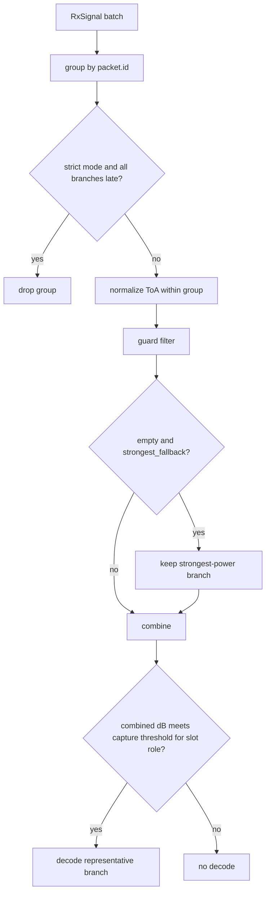

# TDMA / TSM-Style MAC Deep Dive

This page documents the concrete TDMA barrage-style behavior in `radio-sim`.

Implementation roots:

- `crates/radio-sim-core/src/mac/tdma/tdma_mac.rs`
- `crates/radio-sim-core/src/mac/tdma/bac.rs`
- `crates/radio-sim-core/src/mac/tdma/combining.rs`
- `crates/radio-sim-core/src/sim/runner.rs` (slot scheduling and delivery)

## Core Model

- Time is scheduled as explicit `SlotStart/SlotEnd` events over configured slot roles.
- In `DLC` slots, each node attempts origination (if BAC ownership allows) or relay.
- Delivery is processed at `SlotEnd`, then relay arming state is updated.

## Slot Lifecycle



## DLC Pipeline and Relay Behavior

- `global_dlc_index` advances only on DLC slots.
- Slot class is computed via `global_dlc_index % m_pipeline`.
- Relay eligibility requires:
  - packet is armed,
  - slot class match,
  - `current_dlc >= relay_ready_dlc`.

Relay candidate selection is deterministic by:

1. higher packet priority,
2. lower hop count,
3. lower packet ID.

## BAC Scheduling

BAC (`bac.rs`) assigns node ownership to DLC slot indices.

- Single owner in a slot: fixed owner originates.
- Multiple owners in a slot: ownership rotates every `drain_slots`.

This keeps origination fair while preserving deterministic behavior.

## Per-Packet State Perspective



## Combining and Guard Handling

TDMA combines multi-copy receptions by packet ID.

Combining modes:

- `MRC`: sum SINR
- `EGC`: square of sum sqrt(SINR)
- `SC`: max SINR

Guard flow:



Thresholds are role-dependent via `capture_beta_db` for `DLC/RLC/CLC`.

## TTL, Drain, and GC

- On first decode, packet relay state gets TTL in DLC-index space:

```text
ttl_dlc = current_dlc + hop_diameter
```

- GC runs at DLC boundaries and removes relay state whose TTL expired.

## Slot Roles and Current Scope

- `DLC`: active data origination/relay path.
- `RLC`: placeholder branch.
- `CLC`: placeholder branch.

This means current usable TDMA data path is DLC-centric.

## Local Control Status in TDMA

Current TDMA behavior with controller actions:

- `apply_local_action(...)` is a no-op.
- Counter snapshots for controller observations are default/empty for TDMA MAC.

So active PIN control effects are currently CSMA-focused.

## Configuration Surface

Primary TDMA knobs:

- `slots_per_frame`, `slot_duration_ms`, `slot_roles`
- `m_pipeline`, `max_hops`, `hop_diameter`, `drain_slots`
- `guard_time_us`, `guard_fallback_mode`
- `combining_mode`, `capture_beta_db`
- `source_probability`, `broadcast_probability`, `node_queue_size`

Notable constraint:

- `enable_sic = true` is currently rejected by validation.

## Known Gotchas

- `RLC/CLC` are not fully implemented logic paths yet.
- `dcs::SlotState` exists but is not wired into active TDMA decision flow.
- TDMA enqueue currently ignores explicit priority parameter (bounded FIFO behavior).
- The per-node `seen` dedupe set is not currently GC’d, so it grows with unique packet IDs.
