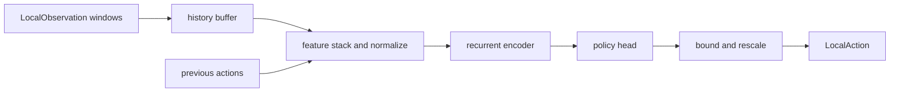
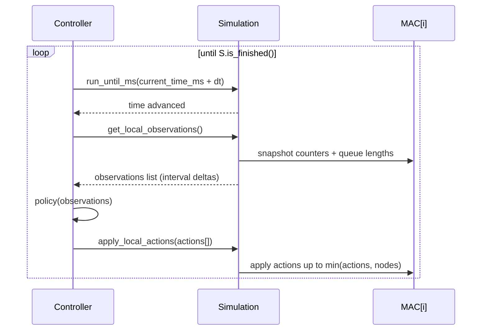
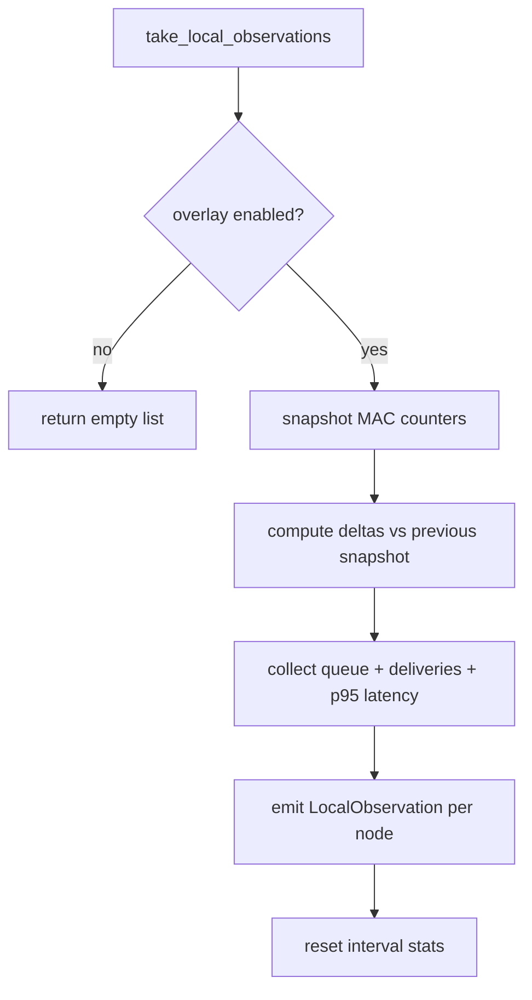
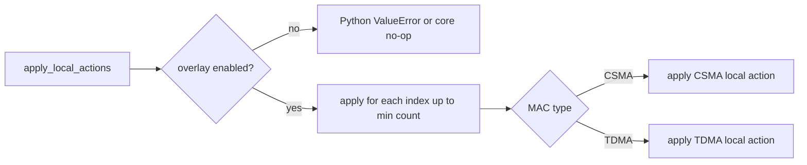

# PIN Controller API

This page defines the runtime contract for external PIN controllers interacting with `radio_sim`.

This page covers the concrete runtime API surface. For the broader distributed PIN/MARL framing, richer observation model, and red-text status split, see [PIN MARL Formulation](pin_marl_formulation.md).
For the recommended v1 learning algorithm and Stackelberg training setup, see [PIN Learning Algorithm](pin_learning_algorithm.md).

Implementation surfaces:

- `crates/radio-sim-py/src/sim.rs`
- `crates/radio-sim-core/src/control.rs`
- `crates/radio-sim-core/src/sim/runner.rs`

## What the Radio Sees

The controller receives one interval-aggregated `LocalObservation` per node every control interval. The CSMA observation surface covers seven axes (full schema in [Observation Schema](#observation-schema) below): queue state, backoff state, sender-local interval counters, destination-side delivery summaries, node-level contention indicators, the set of streams currently queued, and per-neighbor RSSI/PDR topology hints.

Beyond the radio's own boundary, the broader PIN sensing pipeline can layer in scenario- and scene-derived signals that the radio itself cannot measure:

- <span class="status-planned">own position and recent motion history</span>
- <span class="status-planned">terrain, building, road, or other 3D scene summaries</span>
- <span class="status-planned">traffic, role, and mission-context features</span>

Those broader channels are not part of the per-radio runtime API; they enter through scenario and feature-pipeline integrations described in [PIN MARL Formulation](pin_marl_formulation.md).

## Contract Summary

- Controller runs outside the core simulator.
- Control is per-node local action only.
- Caller owns cadence (step timing + when observations and actions are exchanged).
- Action and observation field names are the canonical CSMA control surface defined in [CSMA/CA MAC Deep Dive — Local Control Surface](mac_csma_implementation.md#local-control-surface). This page describes the runtime API shape; that page describes the surface itself.

## Training-Facing Learner Contract

For the first learning milestone, the runtime API does not need to change. The learner lives outside the simulator and owns the state needed to turn the existing observation stream into a recurrent policy input.

The learner/controller owns:

- a per-node observation history buffer over several recent `LocalObservation` windows
- the previous action taken at each node
- recurrent hidden state for each radio policy
- feature stacking and normalization before the policy forward pass
- a bounded action transform that maps policy outputs back into `LocalAction`

The flow is:



Practical interpretation:

- `LocalObservation` stays the runtime boundary.
- The controller appends its own history and hidden state on the client side.
- Action outputs can be continuous inside the learner, but they must be projected back into the bounded per-axis ranges of `LocalAction` (EDCA tuning, queue management, admission, stream-level, PHY tuning, and routing — see [Action Schema](#action-schema)) before calling `apply_local_actions(...)`.
- A learner that only uses the EDCA-tuning axis does not need richer simulator hooks for the first pass.

For the algorithmic details behind this controller-side learner, see [PIN Learning Algorithm](pin_learning_algorithm.md).

## Episode Objective Boundary

The runtime API is intentionally not the same thing as the training objective.

At runtime, the controller gets:

- one `LocalObservation` per radio per control interval
- one `LocalAction` per radio to apply at that interval

At training time, the learner must additionally maintain episode-level state that does not live inside the simulator API:

- per-radio history buffers and recurrent hidden state
- rollout storage for actor/critic updates
- per-radio episode reward accumulators for mission packet IDs and latency samples

That split matters because the canonical MARL reward in the theory docs is:

$$
R_i(\xi)
=
w_{\mathrm{pdr}} \, \mathrm{PDR}_i^{\mathrm{mission}}(\xi)
- w_{\mathrm{lat}} \, \bar{L}_{95,i}^{\mathrm{mission}}(\xi)
$$

which is computed over the full gameplay episode, not from one `LocalObservation` alone.

Practical consequence:

- `get_local_observations()` is the step-level policy input
- `apply_local_actions(...)` is the step-level control output
- $R_i$ is a trainer-side episode-end computation layered on top of rollout data

The current Python bindings expose global run summaries and per-step local telemetry. A future trainer can compute exact per-radio $R_i$ either from packet/event accounting or from an extended episode-summary binding, but that computation should remain conceptually outside the runtime action API.

## Enable Overlay

```python
import radio_sim

cfg = radio_sim.SimConfig()
cfg.set_csma_mac()
cfg.set_control_overlay_enabled(True)
cfg.set_control_observation_interval_ms(250.0)

sim = radio_sim.Simulation(cfg)
```

Notes:

- `observation_interval_ms` is validated metadata; it does not auto-schedule steps.
- `run_until_ms(...)` uses absolute simulation time.

## End-to-End Loop (Recommended)



## Observation Schema

`get_local_observations()` returns one `LocalObservation` per node every control interval. Per-AC fields are dictionaries keyed by `vo / vi / be / bk`. Counters are interval deltas over the observation window.

The seven observation axes (canonical names defined in [CSMA/CA MAC Deep Dive — Observation axes](mac_csma_implementation.md#observation-axes)):

```text
{
  node_id,
  time_ns,

  # 1. Per-AC queue state.
  queue_len:            {vo, vi, be, bk},
  head_of_line_age_ns:  {vo, vi, be, bk},
  retry_count:          {vo, vi, be, bk},

  # 2. Per-AC backoff state.
  backoff_stage:        {vo, vi, be, bk},
  backoff_slots:        {vo, vi, be, bk},
  current_cw_exp:       {vo, vi, be, bk},

  # 3. Per-AC interval counters (sender-local).
  tx_attempts:          {vo, vi, be, bk},
  tx_success:           {vo, vi, be, bk},
  retries:              {vo, vi, be, bk},
  ack_timeouts:         {vo, vi, be, bk},
  drops:                {vo, vi, be, bk},
  internal_collisions:  {vo, vi, be, bk},
  txop_grants:          {vo, vi, be, bk},
  txop_uses:            {vo, vi, be, bk},

  # 4. Per-AC interval delivery (destination-side).
  deliveries:           {vo, vi, be, bk},
  p95_latency_ns:       {vo, vi, be, bk},

  # 5. Node-level.
  collisions,
  cca_busy_fraction,
  mean_backoff_slots,

  # 6. Stream-level.
  streams_present:      {stream_id: bool, ...},

  # 7. Topology hints.
  neighbor_rssi_dbm:    {neighbor_id: float, ...},
  link_pdr:             {neighbor_id: float, ...},
}
```

Important measurement note:

- `tx_attempts`, `tx_success`, `retries`, `ack_timeouts`, and `drops` are node-local MAC interval counters.
- `deliveries` and `p95_latency_ns` are destination-side interval delivery statistics for that node.

A sender-centric reward should not assume every field has identical sender/receiver semantics.

Observation behavior:



## Action Schema

`apply_local_actions(actions)` expects one `LocalAction` dictionary per node. The full schema covers all six action axes from the canonical surface:

```text
{
  # 1. EDCA tuning, per access category. Deltas around the configured baseline.
  aifsn_delta:          {vo, vi, be, bk},
  cw_min_exp_delta:     {vo, vi, be, bk},
  cw_max_exp_delta:     {vo, vi, be, bk},
  txop_limit_us_delta:  {vo, vi, be, bk},

  # 2. Queue management, per access category. Counts and ms thresholds.
  purge_oldest:         {vo, vi, be, bk},
  purge_older_than_ms:  {vo, vi, be, bk},
  head_bypass:          {vo, vi, be, bk},

  # 3. Admission control, per access category.
  max_queue_len:        {vo, vi, be, bk},
  rate_cap_pps:         {vo, vi, be, bk},

  # 4. Stream-level controls (cross-cuts AC).
  pause_stream:         [stream_id, ...],
  resume_stream:        [stream_id, ...],
  drop_stream:          [stream_id, ...],
  reclassify_stream:    {stream_id: target_ac, ...},

  # 5. PHY tuning, per node (slow-cadence).
  tx_power_w,
  mcs_lock:             {vo, vi, be, bk},

  # 6. Routing and topology, per node.
  neighbor_blacklist:   [neighbor_id, ...],
  link_cost_override:   {neighbor_id: cost, ...},
  next_hop_pref:        {dest_id: neighbor_id, ...},
}
```

Action behavior:



## Action Effects in CSMA

Effects of each axis on the CSMA MAC behavior:

- **EDCA tuning.** `aifsn_delta` changes how soon each AC contends after the medium becomes idle. `cw_min_exp_delta` and `cw_max_exp_delta` change the initial and maximum EDCAF contention windows. `txop_limit_us_delta` changes how long the winning AC may continue transmitting inside a granted TXOP.
- **Queue management.** `purge_oldest` and `purge_older_than_ms` remove queued packets without transmitting them; the runtime emits per-AC drop events for each purged packet so the agent's next observation reflects the new state. `head_bypass` re-orders the front of the AC queue once.
- **Admission control.** `max_queue_len` re-checks the AC queue on next enqueue and rejects new arrivals over the cap; `rate_cap_pps` gates new arrivals through a token bucket.
- **Stream-level controls.** `pause_stream` blocks new arrivals tagged with that `stream_id`; `drop_stream` flushes already-queued packets for the stream; `reclassify_stream` changes the AC mapping for subsequent enqueues from that stream.
- **PHY tuning.** `tx_power_w` updates the transmit power used for subsequent TX events; `mcs_lock` caps the data-rate selection per AC.
- **Routing.** Becomes live alongside the multi-hop CSMA routing layer; today CSMA is single-hop and these fields are accepted but inert.

Internal bounds and clamps are documented per axis in [CSMA/CA MAC Deep Dive — Action axes](mac_csma_implementation.md#action-axes).

## Implementation Status

What currently ships in the runtime:

- Action axes 1–4: EDCA tuning, queue management, admission control, and stream-level controls are all wired in `crates/radio-sim-core/src/mac/csma/csma_mac.rs`. Each agent-induced drop emits a `MetricEvent::Drop` with a reason like `agent_purge_oldest`, `agent_purge_older_than`, `agent_drop_stream`.
- Observation axes 1–6: populated by `crates/radio-sim-core/src/sim/runner.rs::take_local_observations` and surfaced in Python by `crates/radio-sim-py/src/sim.rs::get_local_observations`. Axis 6 is the `streams_present` list of stream IDs currently queued at this node.
- `action_outcomes` block in every observation: per-axis interval counts of how many times each control action actually fired (e.g., `purged_oldest`, `admission_drops`, `rate_cap_drops`, `stream_paused_drops`). Lets the agent verify its actions took effect.
- Partial actions: the Python `apply_local_actions` parser accepts dicts with any subset of action keys. Missing keys leave that axis at its `LocalAction::default()` no-op value, so a controller can send only the axes it wants to touch each tick.

Being built (the schema lists the fields; the runtime catches up incrementally):

- Action axis 5 (PHY tuning: `tx_power_w`, `mcs_lock`).
- Action axis 6 (routing) waits on the multi-hop CSMA routing layer.
- Observation axis 7 (topology hints: `neighbor_rssi_dbm`, `link_pdr`).
- TDMA: the action and observation schemas are the same shape, but the TDMA MAC currently treats `apply_local_action` as a no-op. The TDMA control surface gets its own design pass.

Baseline guarantee: when `control_overlay.enabled = false`, the runtime never calls `apply_local_action` and the radio behaves exactly as the baseline emulator. When the overlay is enabled but the controller sends `LocalAction::default()` every tick, behavior is byte-identical to the baseline (pinned by the `overlay_silent_matches_baseline` integration test).

The doc describes the surface a PIN/RL controller targets. Code drift against this surface should be reported as a bug or filed as a follow-up implementation step.

## Edge Cases and Pitfalls

- Overlay disabled: `get_local_observations()` returns empty; Python `apply_local_actions()` raises `ValueError`.
- Action count mismatch: only first `min(len(actions), num_nodes)` entries are applied.
- First observation immediately after init typically has zero counter deltas.
- A useful controller should retain several recent observation windows and previous actions on its own side; the runtime API does not store that history.

## Minimal Reference Loop

The full action schema is dense, so most controllers fill in only the axes they use. Unset axes default to neutral (no change). The example below sets a small EDCA bias plus one stream-level action:

```python
NEUTRAL_AC = {"vo": 0, "vi": 0, "be": 0, "bk": 0}

while not sim.is_finished():
    sim.run_until_ms(sim.current_time_ms() + 250.0)
    obs = sim.get_local_observations()
    if not obs:
        continue

    actions = []
    for ob in obs:
        actions.append(
            {
                # EDCA tuning: deprioritize BE one AIFS slot, give VO 1 ms more TXOP.
                "aifsn_delta":         {"vo": 0, "vi": 0, "be": 1, "bk": 0},
                "cw_min_exp_delta":    NEUTRAL_AC,
                "cw_max_exp_delta":    NEUTRAL_AC,
                "txop_limit_us_delta": {"vo": 1000, "vi": 0, "be": 0, "bk": 0},

                # Stream-level: pause a stalled background stream by id.
                "pause_stream":        [42] if ob["queue_len"]["bk"] > 8 else [],
            }
        )
    sim.apply_local_actions(actions)
```
