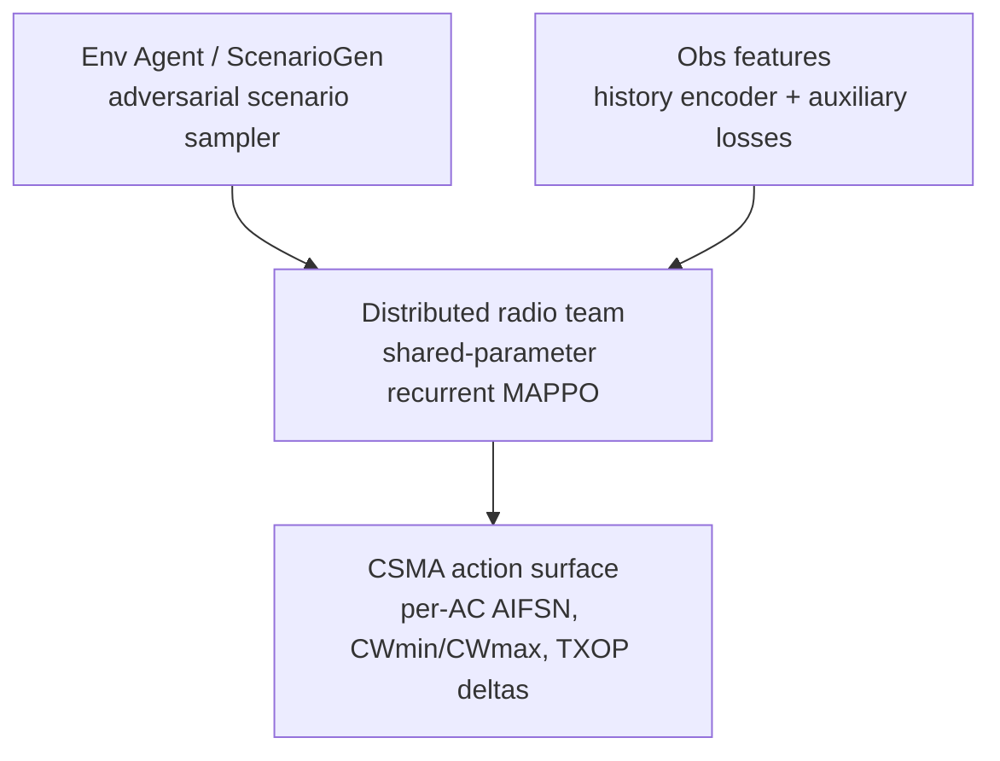
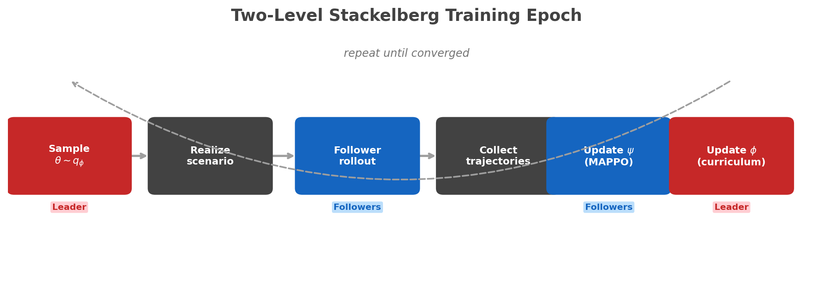
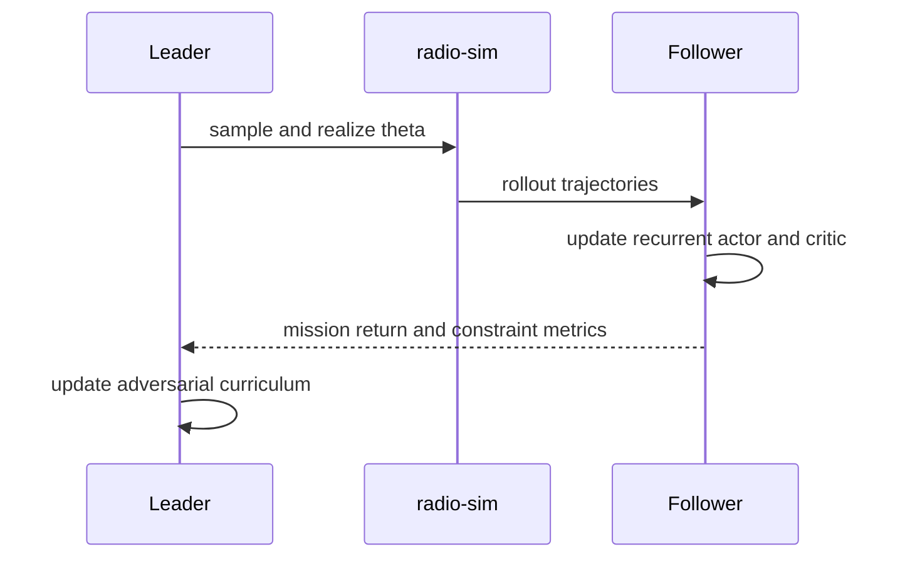

# PIN Learning Algorithm

This page specifies the recommended v1 learning algorithm for the PIN overlay in `radio-sim`.

The goal is to keep the learning story aligned with the current codebase:

- leader: a training-time `Env Agent` (`ScenarioGen`) that samples or sculpts scenario parameters
- follower: a distributed radio team trained with shared-parameter recurrent MAPPO under CTDE
- runtime scope: the current CSMA local action surface only

TDMA learning is not part of v1 because TDMA local actions are still a no-op in the runtime API.

For the problem definition and the red-text observation split, see [PIN MARL Formulation](pin_marl_formulation.md).

## Why this is the right simplification

!!! tip "Simplification Rationale"
    The full hierarchy in `approach.tex` distinguishes ScenarioGen, Obs agents, and NetTop agents as three separate levels. That structure is useful mathematically, but too heavy for the first implementable learner. The clean v1 simplification preserves the leader-follower hierarchy while folding the Obs layer into the follower encoder.

The clean v1 simplification is:

- keep the leader-follower hierarchy
- treat the environment or scenario generator as the training-time leader
- fold the Obs layer into the follower encoder and optional auxiliary prediction losses
- train only against the implemented CSMA action surface

!!! warning "Core Design Decision"
    **The canonical v1 learning view is a two-level Stackelberg game.**

    **The leader commits to the scenario first. The distributed PIN agents then best-respond within that realized world.**

    **Because the leader shapes the scenario before the follower policies act, this is naturally a Stackelberg learning problem rather than a simultaneous-move MARL problem.**

In other words, v1 is a two-level Stackelberg system with richer follower internals, not a full tri-level optimizer.



## v1 formulation

Let $\theta$ denote a sampled scenario specification and let $q_\phi(\theta)$ be the leader distribution over admissible scenarios.

The leader does not control radios directly. Instead, it commits to scenario properties that determine what environment the followers must handle. In this project, those scenario controls can include:

- building layout and removals
- elevation or terrain adjustments
- traffic patterns, burstiness, and class mix
- scenario metadata such as mobility or other mission-context settings

Those edits matter because they alter the RF regime indirectly through the physical world and traffic program. The leader therefore controls the difficulty of the propagation and congestion conditions without becoming a radio controller.

For each episode:

$$
\theta \sim q_{\phi}(\theta), \qquad
\tau \sim \mathcal{M}(\theta)
$$

where $\mathcal{M}$ is the rollout induced by the selected scenario.

Each radio `i` uses a shared-parameter recurrent policy:

$$
a_t^{(i)} \sim \pi_{\psi}\!\left(a_t^{(i)} \mid h_t^{(i)}\right)
$$

with history

$$
h_t^{(i)} = \left(o_0^{(i)}, a_0^{(i)}, \ldots, o_t^{(i)}\right)
$$

where `o_t^{(i)}` is the current `LocalObservation` stream from the runtime API.

Training uses CTDE, with the follower team solving the inner problem induced by the leader through episode-level mission outcomes:

$$
R_{\mathrm{team}}(\xi)
=
\frac{1}{N}\sum_{i=1}^{N} R_i(\xi)
$$

$$
J_{\mathrm{follower}}(\psi; \theta)
=
\mathbb{E}_{\xi \sim \mathcal{M}(\theta), \pi_\psi}
\left[
R_{\mathrm{team}}(\xi)
\right]
$$

The centralized critic may condition on pooled fleet features:

$$
V_{\omega}(s_t, z_t), \qquad
z_t = \mathrm{pool}\left(e_t^{(1)}, \ldots, e_t^{(N)}\right)
$$

where `e_t^{(i)}` is the recurrent embedding for radio `i`.

The leader objective is adversarial curriculum design:

$$
J_{\mathrm{leader}}(\phi)
=
\mathbb{E}_{\theta \sim q_{\phi}}\left[-J_{\mathrm{follower}}(\psi;\theta)\right]
+ \beta \, \mathcal{D}(\theta)
$$

The diversity term $\mathcal{D}(\theta)$ discourages degenerate repetition of the same easy scenario and rewards curriculum breadth or coverage. In practice, this can be as simple as a seed-diversity penalty, a bounded scenario reuse count, or an explicit coverage score over scenario families.

### Why this is a Stackelberg game

!!! warning "Defining Asymmetry"
    **The leader moves first** by choosing the scenario distribution or the realized scenario instance.

    **The followers then act inside** that realized scenario with no ability to change the scenario itself.

    **The leader's utility is defined through** the follower's induced performance, which is the defining leader-follower asymmetry of a Stackelberg game.

That asymmetry is the key modeling point. The Env Agent is not just another MARL player acting simultaneously with the radios. It is a scenario-setting leader whose commitment determines the world in which the follower team must perform.

## Reward and credit assignment

The canonical v1 objective should be defined from gameplay-long PDR and latency, not from a step-local heuristic reward.

For gameplay episode $\xi$, let $\mathcal{P}_i^{\mathrm{mission}}(\xi)$ be the mission-relevant packets for radio $i$ over the full episode and let $\mathcal{D}_i^{\mathrm{mission}}(\xi)$ be the subset that achieves at least one confirmed delivery.

Then:

$$
\mathrm{PDR}_i^{\mathrm{mission}}(\xi)
=
\frac{\left|\mathcal{D}_i^{\mathrm{mission}}(\xi)\right|}{\max\!\left(\left|\mathcal{P}_i^{\mathrm{mission}}(\xi)\right|, 1\right)}
$$

$$
L_{95,i}^{\mathrm{mission}}(\xi)
=
\begin{cases}
Q_{0.95}\!\left(\left\{\ell(p) : p \in \mathcal{D}_i^{\mathrm{mission}}(\xi)\right\}\right),
& \left|\mathcal{D}_i^{\mathrm{mission}}(\xi)\right| > 0 \\
L_{\mathrm{fail}},
& \left|\mathcal{D}_i^{\mathrm{mission}}(\xi)\right| = 0
\end{cases}
$$

$$
\bar{L}_{95,i}^{\mathrm{mission}}(\xi)
=
\min\!\left(
\frac{L_{95,i}^{\mathrm{mission}}(\xi)}{L_{\mathrm{ref}}},
L_{\mathrm{clip}}
\right)
$$

$$
R_i(\xi)
=
w_{\mathrm{pdr}} \, \mathrm{PDR}_i^{\mathrm{mission}}(\xi)
- w_{\mathrm{lat}} \, \bar{L}_{95,i}^{\mathrm{mission}}(\xi)
$$

This means:

- $R_i$ is a per-radio terminal reward computed once from the full gameplay.
- The team objective is the mean of those per-radio rewards.
- $L_{\mathrm{ref}}$ is the latency budget used to normalize units, and $L_{\mathrm{clip}}$ caps extreme latency failures.
- Sender-confirmed PDR semantics carry over directly: unique mission packets with at least one confirmed delivery divided by unique mission packets sent by that radio over the episode.
- A dense shaping reward $r_t^{(i)}$ can still be added during optimization, but it should be treated as a surrogate for $R_i$ rather than the definition of mission success.

## Actor and critic

!!! info "v1 Follower Architecture"
    - A **recurrent encoder** over recent `LocalObservation` windows and prior actions
    - A **shared actor head** that emits bounded CSMA control outputs
    - A **centralized critic** trained from complete rollout data (CTDE)

The actor output maps to the current action tuple:

$$
a_t^{(i)} =
\left(
\mathrm{service\_bias}_t^{(i)},
\mathrm{admission\_threshold}_t^{(i)},
\mathrm{cw\_aggressiveness}_t^{(i)}
\right)
$$

with the existing runtime clamp ranges applied after decoding.

### Optional auxiliary losses

The simplified Obs layer becomes optional auxiliary supervision on top of the follower encoder:

$$
\mathcal{L}_{\mathrm{aux}}
=
\lambda_1 \mathcal{L}_{\mathrm{queue\_pred}}
+ \lambda_2 \mathcal{L}_{\mathrm{loss\_pred}}
+ \lambda_3 \mathcal{L}_{\mathrm{congestion\_pred}}
$$

This is not a separate online agent in v1. It is a training-time helper that can improve representation quality when richer observation channels are added later.

## Training loop



```text
for each outer iteration:
    sample a batch of scenarios from the leader q_phi(theta)
    for each scenario:
        realize the scenario into geometry, propagation, traffic, and other rollout conditions
        roll out radio-sim with the current follower policy pi_psi
        compute gameplay-long PDR and latency for each radio, then form R_i and R_team
        collect trajectories, episode rewards, and constraint metrics
    update follower psi with recurrent MAPPO
    update leader phi with adversarial curriculum gradients
```

More concretely:

1. Sample $\theta$ from the leader.
2. Realize that scenario into geometry, RF, traffic, and mission conditions for the rollout.
3. Roll out the distributed follower team for $T$ control steps.
4. Compute gameplay-long mission PDR and latency for each radio, then construct $R_i$ and the team reward.
5. Update the follower with recurrent MAPPO on the collected trajectories.
6. Update the leader against the measured follower return plus diversity or coverage pressure.
7. Repeat until validation stops improving or the training budget is exhausted.

## Two-level Stackelberg training algorithm

The practical algorithm is alternating optimization of a parameterized leader and follower. This should be read as an approximate training procedure for the Stackelberg problem, not as an exact equilibrium solver.

??? example "Detailed training algorithm (click to expand)"

    ```text
    initialize leader distribution q_phi(theta)
    initialize shared recurrent follower policy pi_psi and critic V_omega

    repeat:
        sample a batch of scenario controls theta from q_phi
        episodes = []

        for theta in batch:
            scenario = realize(theta)
            episode = rollout_distributed_followers(scenario, pi_psi)
            compute per-radio episode rewards R_i from gameplay PDR and latency
            episodes.append(episode)

        update follower actor and critic with recurrent MAPPO under CTDE
        compute leader signal from negative follower return plus diversity pressure
        update q_phi using that leader signal

        evaluate on fixed held-out validation scenarios
    until converged
    ```

??? example "Compact pseudocode (click to expand)"

    ```text
    initialize leader q_phi(theta)
    initialize shared recurrent actor pi_psi and critic V_omega

    repeat:
        scenarios = sample(q_phi)
        trajectories = []

        for theta in scenarios:
            realized_scenario = realize(theta)
            episode = rollout_radio_sim(realized_scenario, pi_psi)
            compute per-radio episode rewards R_i from gameplay PDR and latency
            trajectories.append(episode)

        follower_batch = build_mappo_batch(trajectories)
        update(pi_psi, V_omega, follower_batch)

        leader_signal = compute_adversarial_signal(trajectories)
        update(q_phi, leader_signal)
    until converged
    ```

## Update schedule

The clean v1 schedule is:

- leader updates at episode or macro-episode granularity
- follower actions occur every control interval inside each rollout
- follower updates happen every rollout batch
- critic updates happen on the same batch as the follower
- auxiliary losses update with the actor encoder

This keeps the hierarchy explicit without forcing a brittle nested optimizer into the first implementation.



## What is in scope

- CSMA per-AC EDCA control
- CSMA AIFS and CW tuning
- CSMA TXOP behavior
- shared-parameter decentralized execution
- centralized training over scenario diversity

## What is not in scope

- TDMA learning
- new runtime observations
- full tri-level online Obs/NetTop/ScenarioGen execution
- direct topology control beyond the current action tuple

## Related pages

- [PIN MARL Formulation](pin_marl_formulation.md)
- [PIN Controller API](pin_controller_api.md)
- [PIN Optimal-Control Experiment](pin_optimal_control_experiment.md)
