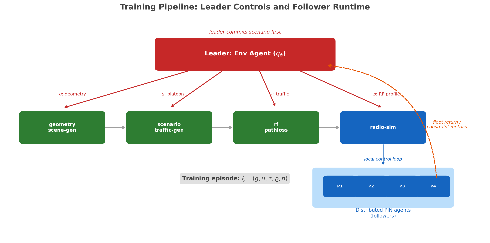
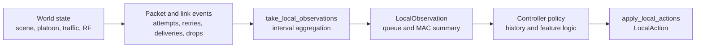
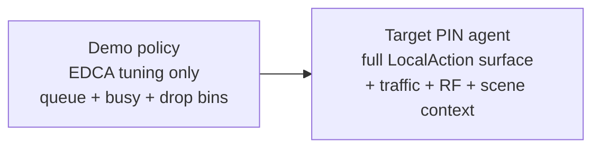
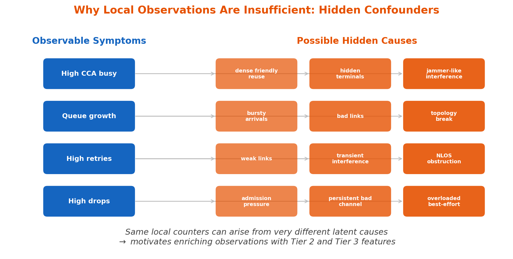
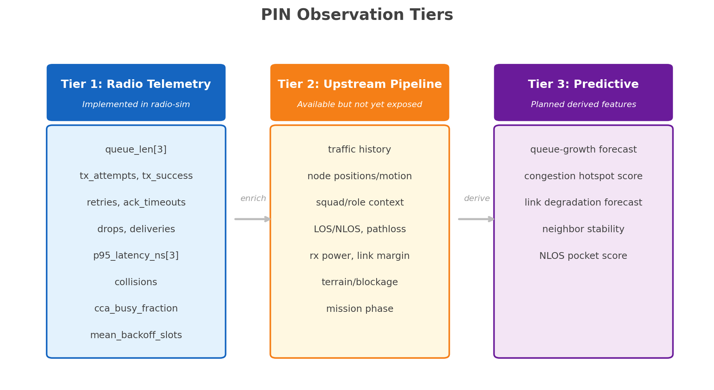
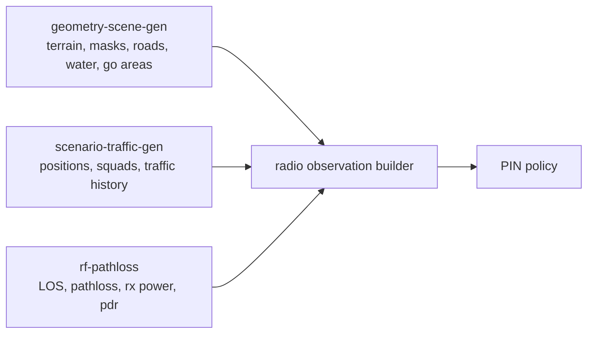
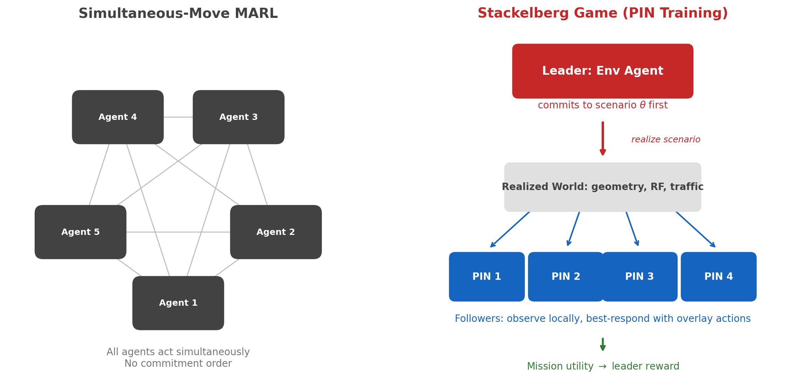
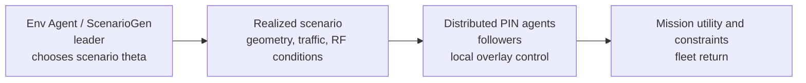
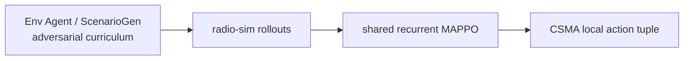

# PIN MARL Formulation

This page is the canonical theory note for the PIN overlay problem in `radio-sim`.
It is organized around one practical question:

> What does the radio actually observe, and is that enough to improve decisions?

It intentionally separates:

- black-text runtime control surfaces that exist in code
- red-text PIN/MARL architecture, sensing, and training scope around that runtime boundary

<div class="status-legend">
<p><strong>Status legend.</strong></p>
<p>Normal black text describes the concrete runtime boundary.</p>
<p><span class="status-planned">Red text marks the broader PIN sensing, training, and architecture scope.</span></p>
</div>

!!! info "Local CSMA control surface"
    Each radio in `radio-sim` carries a local PIN overlay. The controller observes one interval-aggregated `LocalObservation` per node and applies a `LocalAction` covering EDCA tuning, queue management, admission control, stream-level controls, PHY tuning, and routing/topology bias. The canonical field names live in [CSMA/CA MAC Deep Dive — Local Control Surface](mac_csma_implementation.md#local-control-surface). Implementation status for each axis is summarized in that page; this doc treats the full surface as the design and reasons about it as a unified control problem.

!!! warning "Broader PIN Scope"
    <span class="status-planned">The richer PIN sensing bundle adds scene-derived signals that the radio itself cannot measure: terrain and 3D scene features, mission-context labels, and global traffic-program summaries.</span>

    <span class="status-planned">The geometry -> scenario -> RF -> controller training loop is built around the same `radio-sim` control boundary.</span>

## Why the full 3D pipeline exists

!!! tip "Core Motivation"
    The goal is not a single fixed queue-control demo. The goal is to train distributed PIN agents that produce better local overlay actions than the baseline radio behavior **across a wide range of operational conditions**.

The broader tactical pipeline exists so training and evaluation can vary all of the factors that actually matter:

- 3D geometry and terrain
- road, building, foliage, and water structure
- platoon layout and squad configuration
- traffic intensity, burstiness, and class mix
- network profile (`csma`, `tdma`, additional variants)
- RF conditions, pathloss, LOS/NLOS structure, and delivery outcomes

We can write one training episode as:

$$
\xi \sim p_{\mathrm{train}}(\xi), \qquad
\xi = (g, u, \tau, \varrho, n)
$$

where:

- $g$ is the scene or geometry realization
- $u$ is the unit or platoon configuration
- $\tau$ is the traffic program
- $\varrho$ is the RF or environment realization
- $n$ is the network or MAC profile

The high-level training objective is to learn a policy family that performs well across that distribution:

$$
J(\psi) =
\mathbb{E}_{\xi \sim p_{\mathrm{train}}, \Pi_\psi}
\left[
R_{\mathrm{team}}(\xi)
\right]
$$

where $R_{\mathrm{team}}(\xi)$ is the gameplay-level team reward defined below from full-episode PDR and latency.

For any fixed realized episode $\xi$, the follower side is a decentralized partially observed control problem:

$$
s(t + 1; \xi) \sim P_{\xi}\!\left(s(t + 1; \xi)\mid s(t; \xi), a(t; \xi)\right), \qquad
o^{(i)}(t; \xi) = O_{\xi}^{(i)}(s(t; \xi)), \qquad
a^{(i)}(t; \xi) \sim \pi_{\psi}^{(i)}\!\left(a^{(i)}(t; \xi) \mid h^{(i)}(t; \xi)\right)
$$

with joint action

$$
a(t; \xi) = \left(a^{(1)}(t; \xi), \ldots, a^{(N)}(t; \xi)\right)
$$

and local history

$$
h^{(i)}(t; \xi) =
\left(
o^{(i)}(0; \xi), a^{(i)}(0; \xi),
\ldots,
o^{(i)}(t-1; \xi), a^{(i)}(t-1; \xi),
o^{(i)}(t; \xi)
\right)
$$

This is the core problem statement:

- the hidden state $s(t; \xi)$ includes queue state, MAC state, traffic evolution, geometry, and RF conditions
- the runtime radio never sees $s(t; \xi)$ directly
- each radio acts only from its own history $h^{(i)}(t; \xi)$
- training quality is judged by the full-episode reward $R_{\mathrm{team}}(\xi)$, not by one interval in isolation



### Software mapping

| Math object or concept | Current software anchor | Status |
| --- | --- | --- |
| $g$ and scene-layer diversity | `geometry-scene-gen/contracts/geometry_bundle.schema.json` | implemented upstream |
| $u$ and platoon configuration | `scenario-traffic-gen/scenario_traffic_gen/wrapper.py` | implemented upstream |
| $\tau$ and traffic program | `scenario-traffic-gen/scenario_traffic_gen/wrapper.py` | implemented upstream |
| $\varrho$ and RF realization | `rf-pathloss/rf_pathloss/enrich.py` | implemented upstream |
| radio policy I/O boundary | `crates/radio-sim-core/src/control.rs`, `crates/radio-sim-core/src/sim/runner.rs`, `crates/radio-sim-py/src/sim.rs` | implemented |
| <span class="status-planned">full scene-conditioned PIN training loop</span> | <span class="status-planned">integration through the `radio-sim` control boundary</span> | <span class="status-planned">broader PIN scope</span> |

`radio-sim` already provides the local control overlay boundary for CSMA queue, admission, and contention behavior. The broader geometry/scenario/RF-conditioned PIN program builds outward from that boundary.

## Notation and measurement conventions

For clarity, this page uses function notation whenever a quantity depends on time, episode, node, or class:

- episode-level quantity: $x(\xi)$
- node-local time-varying quantity: $x^{(i)}(t; \xi)$
- per-class node-local quantity: $x_c^{(i)}(t; \xi)$

We also distinguish four measurement statuses:

- observed: exposed directly to the controller by the runtime API or an upstream feature bundle
- calculated: exact deterministic summary of emitted logs, packet IDs, or event samples over a chosen horizon
- estimated: controller-side inference or proxy, written with a hat such as $\hat{x}$
- latent: a true environment quantity that exists in the simulator or world model but is not exposed at decision time

Pathloss is the cleanest example:

$$
\rho_{ij}(t; \xi) = \text{true pathloss on link } j \rightarrow i
$$

$$
\hat{\rho}_{ij}(t; \xi) = g_{\eta}\!\left(z_{ij}(t; \xi)\right)
$$

where $z_{ij}(t; \xi)$ is any available proxy bundle, such as RSSI, SNR, rx-power, link-margin, ACK or retry history, and neighbor-relative geometry when those channels exist.

The intended interpretation in this repo is:

- $\rho_{ij}(t; \xi)$ is latent at the current `LocalObservation` boundary
- $\rho_{ij}(t; \xi)$ can be calculated exactly offline from the upstream RF/environment pipeline or analytic channel model
- $\hat{\rho}_{ij}(t; \xi)$ is what a deployable PIN controller should consume when direct pathloss is unavailable
- if no RF proxy channel is exposed, then pathloss remains latent and only affects the controller indirectly through counters such as retries, drops, and deliveries

## What the radio sees

The radio does **not** observe the full world state directly. It operates from a local observation bundle assembled at the radio edge.

The full PIN observation model is:

$$
\tilde{o}^{(i)}(t; \xi) =
\left[
q^{(i)}(t; \xi),
u^{(i)}(t; \xi),
d^{(i)}(t; \xi),
\ell^{(i)}(t; \xi),
c^{(i)}(t; \xi),
x_{\mathrm{self}}^{(i)}(t; \xi),
x_{\mathrm{peer}}^{(i)}(t; \xi),
\hat{\rho}_{\mathrm{rf}}^{(i)}(t; \xi),
\tau_{\mathrm{traffic}}^{(i)}(t; \xi),
m^{(i)}(t; \xi)
\right]
$$

where:

- $q^{(i)}(t; \xi)$ is the per-class queue-length vector
- $u^{(i)}(t; \xi)$ contains per-class tx attempts, tx successes, retries, and ACK timeouts
- $d^{(i)}(t; \xi)$ contains per-class drops and deliveries
- $\ell^{(i)}(t; \xi)$ contains per-class p95 latency
- $c^{(i)}(t; \xi)$ contains collision and contention indicators
- <span class="status-planned">$x_{\mathrm{self}}^{(i)}(t; \xi)$ is the radio's own position, heading, speed, and short motion history</span>
- <span class="status-planned">$x_{\mathrm{peer}}^{(i)}(t; \xi)$ summarizes nearby peer-relative geometry and limited neighbor position or contact history</span>
- <span class="status-planned">$\hat{\rho}_{\mathrm{rf}}^{(i)}(t; \xi)$ is an observed or estimated local RF summary built from SNR, RSSI, rx-power, link-margin, pathloss proxies, or obstruction proxies</span>
- <span class="status-planned">$\tau_{\mathrm{traffic}}^{(i)}(t; \xi)$ summarizes recent traffic-arrival history, burstiness, and local traffic-role context</span>
- <span class="status-planned">$m^{(i)}(t; \xi)$ captures mission, role, and network-mode context</span>

The measurement status of those groups is:

| Quantity | Meaning | Status | How obtained | Code or environment anchor |
| --- | --- | --- | --- | --- |
| $q^{(i)}(t; \xi)$ | queue state | observed | emitted directly by `LocalObservation.queue_len` | `crates/radio-sim-core/src/sim/runner.rs` |
| $u^{(i)}(t; \xi)$ | tx attempt and success history | observed / calculated over the interval | MAC counter deltas between observation snapshots | `crates/radio-sim-core/src/sim/runner.rs` |
| $d^{(i)}(t; \xi)$ | drop and delivery history | calculated over the node-local interval | drops from local MAC counters; deliveries from delivery-event accumulation | `crates/radio-sim-core/src/sim/runner.rs` |
| $\ell^{(i)}(t; \xi)$ | latency summary | calculated over the node-local interval | p95 over interval latency samples gathered from delivery events | `crates/radio-sim-core/src/sim/runner.rs` |
| $c^{(i)}(t; \xi)$ | contention and collision indicators | observed / calculated over the interval | direct runtime fields such as `collisions`, `cca_busy_fraction`, `mean_backoff_slots` | `crates/radio-sim-core/src/sim/runner.rs` |
| <span class="status-planned">$x_{\mathrm{self}}^{(i)}(t; \xi)$</span> | own kinematics | <span class="status-planned">observed if upstream position feed exists</span> | <span class="status-planned">scenario or mobility feed to the observation builder</span> | `scenario-traffic-gen` |
| <span class="status-planned">$x_{\mathrm{peer}}^{(i)}(t; \xi)$</span> | peer-relative geometry | <span class="status-planned">observed or estimated</span> | <span class="status-planned">neighbor positions, contact history, or geometry featurizer</span> | `scenario-traffic-gen`, observation builder |
| <span class="status-planned">$\hat{\rho}_{\mathrm{rf}}^{(i)}(t; \xi)$</span> | RF proxy or pathloss proxy summary | <span class="status-planned">estimated or side-loaded observation</span> | <span class="status-planned">future RF summary channel or estimator built from RSSI/SNR/rx-power/link-margin and geometry priors</span> | `rf-pathloss`, future observation builder |
| <span class="status-planned">$\rho_{ij}(t; \xi)$</span> | true link pathloss | <span class="status-planned">latent at runtime, calculable offline</span> | <span class="status-planned">analytic channel or `rf-pathloss` outputs</span> | `crates/radio-sim-core/src/phy/channel.rs`, `rf-pathloss/rf_pathloss/enrich.py` |
| <span class="status-planned">$\tau_{\mathrm{traffic}}^{(i)}(t; \xi)$</span> | traffic-history context | <span class="status-planned">observed or calculated from scenario history</span> | <span class="status-planned">arrival history and role context from traffic generator outputs</span> | `scenario-traffic-gen` |
| <span class="status-planned">$m^{(i)}(t; \xi)$</span> | mission and network context | <span class="status-planned">observed</span> | <span class="status-planned">scenario metadata or runtime configuration</span> | `scenario-traffic-gen`, config layer |

The base layer is interval-aggregated queue and MAC outcomes:



The runtime API exposes that base layer as `LocalObservation`. The implemented radio-telemetry slice is:

$$
o^{(i)}(t; \xi) =
\left[
q^{(i)}(t; \xi),
u^{(i)}(t; \xi),
d^{(i)}(t; \xi),
\ell^{(i)}(t; \xi),
c^{(i)}(t; \xi)
\right]
$$

The base `LocalObservation` fields are:

| Field | Meaning | Units or type | Software source |
| --- | --- | --- | --- |
| `node_id` | local node identity | integer | `crates/radio-sim-core/src/control.rs` |
| `time_ns` | observation timestamp | ns | `crates/radio-sim-core/src/control.rs` |
| `queue_len`, `head_of_line_age_ns`, `retry_count` | per-AC EDCA queue state keyed by `vo`, `vi`, `be`, `bk` | packets / ns / count | `crates/radio-sim-core/src/sim/runner.rs` |
| `backoff_stage`, `backoff_slots`, `current_cw_exp` | per-AC EDCA contention state keyed by `vo`, `vi`, `be`, `bk` | count / slots / exponent | `crates/radio-sim-core/src/sim/runner.rs` |
| `tx_attempts`, `tx_success`, `retries`, `ack_timeouts` | interval tx activity by access category | count | `crates/radio-sim-core/src/sim/runner.rs` |
| `drops`, `deliveries`, `p95_latency_ns` | interval drop, delivery, and latency summary by access category | count / ns | `crates/radio-sim-core/src/sim/runner.rs` |
| `internal_collisions`, `txop_grants`, `txop_uses` | interval EDCA internal-collision and TXOP summary | count | `crates/radio-sim-core/src/sim/runner.rs` |
| `collisions` | interval collision count | count | `crates/radio-sim-core/src/sim/runner.rs` |
| `cca_busy_fraction` | fraction of busy CCA samples | $[0,1]$ | `crates/radio-sim-core/src/sim/runner.rs` |
| `mean_backoff_slots` | mean sampled backoff | slots | `crates/radio-sim-core/src/sim/runner.rs` |

For node $i$ at control step $t$, the controller-side history is:

$$
h^{(i)}(t; \xi) =
\left(
o^{(i)}(0; \xi), a^{(i)}(0; \xi),
\ldots,
o^{(i)}(t-1; \xi), a^{(i)}(t-1; \xi),
o^{(i)}(t; \xi)
\right)
$$

This history is not stored inside `LocalObservation`. The controller owns it. In practice, a useful policy should retain:

- several recent observation windows
- several recent actions
- short-term queue growth and delivery trends derived from those windows

### Software mapping

| Behavior | Current software anchor | Status |
| --- | --- | --- |
| `LocalObservation` struct definition | `crates/radio-sim-core/src/control.rs` | implemented |
| interval aggregation of counters, queue lengths, and latency | `crates/radio-sim-core/src/sim/runner.rs` | implemented |
| Python dictionary exposure of observation fields | `crates/radio-sim-py/src/sim.rs` | implemented |
| controller-managed observation history | external controller logic such as `crates/radio-sim-core/examples/pin_csma_demo.rs` | implemented outside core API |

<span class="status-planned">In the full PIN model, the richer sensing terms in $\tilde{o}_t^{(i)}$ are carried alongside the base radio telemetry rather than treated as a separate afterthought.</span>

## Local CSMA control problem

Each radio in `radio-sim` carries a per-node PIN overlay on top of the CSMA MAC. Every control interval, the controller reads one local observation and applies one local action. Both the observation and the action are bounded, local-only, and use the same `VO / VI / BE / BK` access categories the MAC exposes.

The action for radio $i$ at step $t$ has six axes (canonical field names in [CSMA/CA MAC Deep Dive — Action axes](mac_csma_implementation.md#action-axes)):

$$
a_t^{(i)} =
\left(
a_{\mathrm{edca},t}^{(i)},
a_{\mathrm{queue},t}^{(i)},
a_{\mathrm{admit},t}^{(i)},
a_{\mathrm{stream},t}^{(i)},
a_{\mathrm{phy},t}^{(i)},
a_{\mathrm{route},t}^{(i)}
\right)
$$

The EDCA-tuning sub-axis $a_{\mathrm{edca},t}^{(i)}$ is itself a 4-tuple over $\mathcal{A} = \{\mathrm{VO}, \mathrm{VI}, \mathrm{BE}, \mathrm{BK}\}$:

$$
a_{\mathrm{edca},t}^{(i)} =
\left(
\Delta \alpha_t^{(i)},
\Delta \omega_t^{\min,(i)},
\Delta \omega_t^{\max,(i)},
\Delta \chi_t^{(i)}
\right),
\qquad
\Delta \alpha_t^{(i)},\, \Delta \omega_t^{\min,(i)},\, \Delta \omega_t^{\max,(i)},\, \Delta \chi_t^{(i)} \in \mathbb{Z}^{|\mathcal{A}|}
$$

with code-level interpretation:

- $\Delta \alpha_t^{(i)}$ is `aifsn_delta`
- $\Delta \omega_t^{\min,(i)}$ is `cw_min_exp_delta`
- $\Delta \omega_t^{\max,(i)}$ is `cw_max_exp_delta`
- $\Delta \chi_t^{(i)}$ is `txop_limit_us_delta`

These EDCA deltas apply around the configured EDCA baseline and are clamped to keep effective `AIFSN >= 1`, effective `CWmin / CWmax` exponents in `[1, 12]` with `CWmax >= CWmin`, and effective `TXOP >= 0`.

The remaining sub-axes give the agent levers beyond contention tuning:

- $a_{\mathrm{queue},t}^{(i)}$ — per-AC queue manipulation: `purge_oldest`, `purge_older_than_ms`, `head_bypass`. Lets the agent shed stale packets and reorder within an AC.
- $a_{\mathrm{admit},t}^{(i)}$ — per-AC admission control: `max_queue_len`, `rate_cap_pps`. Lets the agent shed load proactively rather than via tail drops.
- $a_{\mathrm{stream},t}^{(i)}$ — stream-level controls: `pause_stream`, `resume_stream`, `drop_stream`, `reclassify_stream`. Lets the agent reason at the flow level instead of the packet level.
- $a_{\mathrm{phy},t}^{(i)}$ — per-node PHY tuning: `tx_power_w`, `mcs_lock`. Slow-cadence levers for topology and rate-adaptation control.
- $a_{\mathrm{route},t}^{(i)}$ — per-node routing bias: `neighbor_blacklist`, `link_cost_override`, `next_hop_pref`. Becomes effective alongside the multi-hop CSMA routing layer.

The observation $o_t^{(i)}$ that conditions $a_t^{(i)}$ covers seven axes — queue state, backoff state, sender-local interval counters, destination-side delivery summaries, node-level contention indicators, the set of streams currently queued, and per-neighbor RSSI/PDR topology hints. The full per-axis field list is in [CSMA/CA MAC Deep Dive — Observation axes](mac_csma_implementation.md#observation-axes).

### Implementation status

EDCA tuning ($a_{\mathrm{edca}}$), queue management ($a_{\mathrm{queue}}$), admission control ($a_{\mathrm{admit}}$), and stream-level controls ($a_{\mathrm{stream}}$) are all wired in `crates/radio-sim-core/src/mac/csma/csma_mac.rs`. Each agent-induced drop emits a `MetricEvent::Drop` with a reason like `agent_purge_oldest`, `agent_purge_older_than`, or `agent_drop_stream`, so reward computations can attribute drops to the action that caused them. Observation axes 1–6 (queue state, backoff state, sender-local counters, destination-side delivery, node-level indicators, and `streams_present`) are populated, plus a per-axis `action_outcomes` block giving the agent feedback on every action it sent. PHY tuning ($a_{\mathrm{phy}}$), routing ($a_{\mathrm{route}}$), and topology-hint observations are part of the unified surface and land incrementally; the code catches up to the doc.

Baseline guarantee: when `control_overlay.enabled = false`, no action is applied and the radio behaves exactly as the baseline emulator. Sending `LocalAction::default()` every tick with the overlay enabled is byte-identical to baseline (pinned by the `overlay_silent_matches_baseline` integration test).

### Step-local shaping reward (current demo)

A useful demo reward is a step-local shaping signal computed from the local observation:

$$
\max_{\pi_{\mathrm{demo}}}
\;
\mathbb{E}
\left[
\sum_{t=0}^{T-1} \gamma^t r^{(i)}(t; \xi)
\right]
$$

with one current demonstrator instance:

$$
r^{(i)}(t; \xi) =
\alpha \, \mathrm{PDR}^{\mathrm{high},(i)}(t; \xi)
- \beta \, L_{95}^{\mathrm{high},(i)}(t; \xi)
- \delta \, D^{\mathrm{high},(i)}(t; \xi)
+ \zeta \, Y^{\mathrm{high},(i)}(t; \xi)
$$

where `high` means the command and voice classes combined. That demo reward is useful as a local training heuristic, but it is not the canonical gameplay objective for the broader MARL program.

### How the current demo calculates this reward

For the current `pin_csma_demo.rs` implementation, let the high-priority class set be

$$
\mathcal{H} = \{\mathrm{VO}, \mathrm{VI}\}
$$

For node $i$ at step $t$, the code computes:

$$
A^{\mathrm{high},(i)}(t; \xi) = \sum_{c \in \mathcal{H}} \mathrm{tx\_attempts}_c^{(i)}(t; \xi)
$$

$$
S^{\mathrm{high},(i)}(t; \xi) = \sum_{c \in \mathcal{H}} \mathrm{tx\_success}_c^{(i)}(t; \xi)
$$

$$
\mathrm{PDR}^{\mathrm{high},(i)}(t; \xi) =
\begin{cases}
\dfrac{S^{\mathrm{high},(i)}(t; \xi)}{A^{\mathrm{high},(i)}(t; \xi)}, & A^{\mathrm{high},(i)}(t; \xi) > 0 \\
0, & A^{\mathrm{high},(i)}(t; \xi) = 0
\end{cases}
$$

$$
D^{\mathrm{high},(i)}(t; \xi) = \sum_{c \in \mathcal{H}} \mathrm{drops}_c^{(i)}(t; \xi)
$$

$$
Y^{\mathrm{high},(i)}(t; \xi) = \sum_{c \in \mathcal{H}} \mathrm{deliveries}_c^{(i)}(t; \xi)
$$

$$
L_{95}^{\mathrm{high},(i)}(t; \xi) =
\max\!\left(
\mathrm{p95\_latency}_{\mathrm{VO}}^{(i)}(t; \xi),
\mathrm{p95\_latency}_{\mathrm{VI}}^{(i)}(t; \xi)
\right)
$$

with latency converted from nanoseconds to milliseconds before applying the coefficient $\beta$.

Substituting those definitions gives the implemented step reward:

$$
r^{(i)}(t; \xi)
=
\alpha \, \mathrm{PDR}^{\mathrm{high},(i)}(t; \xi)
- \beta \, L_{95}^{\mathrm{high},(i)}(t; \xi)
- \delta \, D^{\mathrm{high},(i)}(t; \xi)
+ \zeta \, Y^{\mathrm{high},(i)}(t; \xi)
$$

### What is exact here and what is only a proxy

This is where the current demo should be read carefully.

- `tx_attempts`, `tx_success`, and `drops` are local transmitter or queue-side interval counters for node $i$.
- `deliveries` and `p95_latency_ns` are accumulated from delivery events at the destination node, so they are receiver-side interval quantities in the current `LocalObservation`.

That means the current demo reward mixes sender-local and receiver-local telemetry inside one step reward. It is therefore best interpreted as a useful local congestion proxy, not as an exact per-node mission utility.

More specifically:

- The current $\mathrm{PDR}^{\mathrm{high},(i)}(t; \xi)$ is not exact sender-confirmed PDR. It is an interval transmission-success ratio, `tx_success / tx_attempts`.
- The current $L_{95}^{\mathrm{high},(i)}(t; \xi)$ is not the exact p95 of pooled high-priority packet latencies. It is the maximum of the per-class `VO` and `VI` interval p95 values, which is a conservative proxy.
- The current $D^{\mathrm{high},(i)}(t; \xi)$ is a drop-event count, not a count of unique packets that ultimately failed by the chosen horizon.
- The current $Y^{\mathrm{high},(i)}(t; \xi)$ is a delivery-event count at the observing node, not a sender-confirmed unique-packet count.

### How these terms should be measured if we want the exact quantity

If the goal is the exact step- or episode-level mission quantity rather than a shaping proxy, the trainer should measure them from packet IDs and delivery events:

$$
\mathrm{PDR}^{\mathrm{high,exact}}
=
\frac{\left|\{\text{high-priority packet IDs with at least one delivery}\}\right|}
{\max\!\left(\left|\{\text{high-priority packet IDs sent}\}\right|, 1\right)}
$$

$$
L_{95}^{\mathrm{high,exact}}
=
Q_{0.95}\!\left(\{\text{latencies of delivered high-priority packet IDs}\}\right)
$$

In other words:

- exact PDR needs unique packet-ID accounting, not only aggregate tx counters
- exact latency needs the delivered-packet latency sample set, not only per-class aggregate p95s
- exact failure counts need undelivered unique packet IDs by the chosen horizon, not only drop events

That is why the broader MARL objective in this document is defined from gameplay-long $R_i(\xi)$ rather than directly from this step reward.

### Software mapping

| Action axis | Code anchor | Status |
| --- | --- | --- |
| `LocalAction` field definitions | `crates/radio-sim-core/src/control.rs` | shipped |
| Python action boundary | `crates/radio-sim-py/src/sim.rs` | shipped |
| EDCA tuning ($a_{\mathrm{edca}}$) — per-AC `aifsn_delta`, `cw_min_exp_delta`, `cw_max_exp_delta`, `txop_limit_us_delta` | `crates/radio-sim-core/src/mac/csma/csma_mac.rs` | shipped |
| Queue management ($a_{\mathrm{queue}}$) — per-AC `purge_oldest`, `purge_older_than_ms` | `crates/radio-sim-core/src/mac/csma/csma_mac.rs::apply_local_action` | shipped |
| Admission control ($a_{\mathrm{admit}}$) — per-AC `max_queue_len`, `rate_cap_pps` | `crates/radio-sim-core/src/mac/csma/csma_mac.rs::enqueue` | shipped |
| Stream-level ($a_{\mathrm{stream}}$) — `pause_streams`, `resume_streams`, `drop_streams`, `reclassify_streams` | `crates/radio-sim-core/src/mac/csma/csma_mac.rs` | shipped |
| Action-outcome telemetry — per-axis interval counts in `LocalObservation.action_outcomes` | `crates/radio-sim-core/src/sim/runner.rs::take_local_observations` | shipped |
| PHY tuning ($a_{\mathrm{phy}}$) — `tx_power_w`, per-AC `mcs_lock` | `crates/radio-sim-core/src/phy/`, `crates/radio-sim-core/src/mac/csma/csma_mac.rs` | being built |
| Routing/topology ($a_{\mathrm{route}}$) — `neighbor_blacklist`, `link_cost_override`, `next_hop_pref` | (multi-hop CSMA routing layer, pending) | being built |
| Example policy state bins and reward | `crates/radio-sim-core/examples/pin_csma_demo.rs` | shipped demo |



This step-shaping reward and the demo policy in `pin_csma_demo.rs` exercise the EDCA-tuning sub-axis. The remaining sub-axes are part of the same `LocalAction` surface and become live as the underlying MAC paths land. TDMA carries the same `LocalAction` shape but its `apply_local_action` is currently a no-op; the TDMA control surface gets its own design pass.

## Why the telemetry slice is enough for the narrow demo

The telemetry slice above is enough to support a narrow and defensible claim:

> A local controller can improve EDCA contention behavior in new environments when the task remains congestion-reactive and the action space remains local and radio-adjacent.

That claim is defensible because:

- the observation window is aligned with the action surface
- the observation fields directly measure the outcomes that the local action changes
- the controller can improve from local rates, ratios, and short histories without needing absolute map identity
- the demo already uses a reduced observation-derived state in `crates/radio-sim-core/examples/pin_csma_demo.rs`

The minimum sufficient observation set for this local-control problem is:

- `queue_len`, `head_of_line_age_ns`, `retry_count`
- `backoff_stage`, `backoff_slots`, `current_cw_exp`
- `tx_attempts`, `tx_success`, `retries`, `ack_timeouts`
- `drops`, `deliveries`, `p95_latency_ns`
- `internal_collisions`, `txop_grants`, `txop_uses`
- `collisions`, `cca_busy_fraction`, `mean_backoff_slots`
- short controller-side history over the last few windows
- previous actions so the controller can reason about delayed effects

## Why the telemetry slice is not enough for the full PIN claim

The telemetry slice is too reactive to support a stronger claim such as:

> The trained radio already generalizes robustly across new 3D scenes, platoon layouts, traffic mixes, and RF environments.

That broader claim requires the radio to observe more of the causal state behind congestion and loss.

!!! warning "Hidden state and confounders"
    Similar local counters can come from very different latent causes. The key issue is that `LocalObservation` mostly summarizes **what already happened** after the environment expressed itself through congestion or loss. The broader PIN sensing bundle carries the causal context needed for strong cross-environment generalization claims.



| Observed symptom | Possible latent causes | Why that matters |
| --- | --- | --- |
| high `cca_busy_fraction` | dense friendly reuse, hidden terminals, jammer-like interference, relay bottleneck | different causes call for different queue and contention actions |
| queue growth | bursty arrivals, bad links, topology break, platoon geometry shift | queue growth alone does not explain whether to admit less, reprioritize harder, or change contention behavior |
| high retries | weak links, transient interference, NLOS obstruction, synchronized congestion | retry count alone does not identify the physical cause |
| high drops | admission pressure, persistent bad channel, overloaded best-effort traffic | drops do not reveal whether demand or channel is driving failure |

## Tiered observation model

!!! tip "Three-tier observation design"
    The observation design is a staged enrichment pipeline, not a single flat vector. Each tier adds causal context that the previous tier lacks.



The three tiers are:

- the radio-telemetry slice exposed by `radio-sim`
- the broader TSM pipeline channels that feed the PIN sensing model
- what a truly predictive overlay would add on top of that

### Tier 1: observed now by `radio-sim`

This is the observation surface available directly to `apply_local_actions(...)` controllers.

| Group | Fields or examples | Software source | Status |
| --- | --- | --- | --- |
| Queue state | `queue_len`, `head_of_line_age_ns`, `retry_count` keyed by `vo`, `vi`, `be`, `bk` | `crates/radio-sim-core/src/sim/runner.rs` | implemented |
| EDCA contention state | `backoff_stage`, `backoff_slots`, `current_cw_exp` keyed by `vo`, `vi`, `be`, `bk` | `crates/radio-sim-core/src/sim/runner.rs` | implemented |
| MAC attempt and outcome history | `tx_attempts`, `tx_success`, `retries`, `ack_timeouts` keyed by `vo`, `vi`, `be`, `bk` | `crates/radio-sim-core/src/sim/runner.rs` | implemented |
| Delivery and drop history | `drops`, `deliveries`, `internal_collisions`, `txop_grants`, `txop_uses` keyed by `vo`, `vi`, `be`, `bk` | `crates/radio-sim-core/src/sim/runner.rs` | implemented |
| Latency summary | `p95_latency_ns` keyed by `vo`, `vi`, `be`, `bk` | `crates/radio-sim-core/src/sim/runner.rs` | implemented |
| Contention summary | `collisions`, `cca_busy_fraction`, `mean_backoff_slots` | `crates/radio-sim-core/src/sim/runner.rs` | implemented |
| Identity and time | `node_id`, `time_ns` | `crates/radio-sim-core/src/control.rs` | implemented |

### Tier 2: broader pipeline channels for the PIN sensing model

These data already exist elsewhere in the broader stack and define the next layer of the PIN sensing model.

<span class="status-planned">This tier is important because it is where the first major observation expansion should come from: own kinematics, neighbor-relative geometry, and RF-quality summaries such as SNR/RSSI/rx-power/pathloss proxies.</span>



| Group | Example features | Existing provenance | Exposure status |
| --- | --- | --- | --- |
| Traffic history | recent arrivals by class, burstiness, queue growth over recent windows, source or destination role mix | `scenario-traffic-gen/scenario_traffic_gen/wrapper.py` | <span class="status-planned">PIN sensing channel</span> |
| Node kinematics | own position, recent motion, squad assignment, role, neighbor-relative geometry | `scenario-traffic-gen/scenario_traffic_gen/mobility_import.py` and `scenario-traffic-gen/scenario_traffic_gen/wrapper.py` | <span class="status-planned">PIN sensing channel</span> |
| RF summaries | LOS/NLOS, pathloss, rx power, per-link delivery outcomes | `rf-pathloss/rf_pathloss/enrich.py` | <span class="status-planned">PIN sensing channel</span> |
| 3D scene context | terrain, navmask, roads, water, open fields, go areas, foliage assets | `geometry-scene-gen/contracts/geometry_bundle.schema.json` | <span class="status-planned">PIN sensing channel</span> |
| Mission and network context | network type, mission phase, platoon configuration | `scenario-traffic-gen/scenario_traffic_gen/wrapper.py` | <span class="status-planned">PIN sensing channel</span> |

### Tier 3: predictive or belief-state features

These are not simply raw fields from another module. They are controller-side or trainer-side derived features that would make the overlay meaningfully predictive rather than purely reactive.

$$
\tilde{o}_t^{(i)} =
\left[
o_{t,\mathrm{radio}}^{(i)},
o_{t,\mathrm{traffic}}^{(i)},
o_{t,\mathrm{kin}}^{(i)},
o_{t,\mathrm{rf}}^{(i)},
o_{t,\mathrm{scene}}^{(i)},
o_{t,\mathrm{mission}}^{(i)},
o_{t,\mathrm{pred}}^{(i)}
\right]
$$

| Group | Example features | Integration point | Status |
| --- | --- | --- | --- |
| Prediction features | queue-growth forecast, congestion hotspot score, short-horizon link degradation forecast | <span class="status-planned">controller-side featurizer attached to the `LocalObservation` boundary</span> | <span class="status-planned">predictive sensing layer</span> |
| Neighbor-aware summaries | neighbor contact stability, peer success history, hop-distance proxy to critical sinks | <span class="status-planned">observation expansion in `control.rs`, `runner.rs`, and `sim.rs`</span> | <span class="status-planned">predictive sensing layer</span> |
| Scene-conditioned local descriptors | local blockage density, NLOS pocket score, road or open-area proximity | <span class="status-planned">observation builder using geometry bundle assets</span> | <span class="status-planned">predictive sensing layer</span> |

### Observability gap

| Decision-relevant factor | Present in broader stack? | Present in `LocalObservation` slice? | Needed for the full PIN milestone? |
| --- | --- | --- | --- |
| queue pressure and contention | yes | yes | yes |
| recent arrivals and burstiness | yes | no | yes |
| own position and recent motion | yes | no | yes |
| squad or role context | yes | no | yes |
| LOS/NLOS and pathloss | yes | no | yes |
| rx-power or link-margin proxy | yes | no | yes |
| terrain or blockage context | yes | no | yes |
| predicted queue or link trend | no, derived feature | no | <span class="status-planned">yes</span> |

### Minimum first full MARL observation set

The realistic minimum for the first end-to-end PIN milestone is:

- all Tier 1 radio telemetry
- recent traffic-arrival history by class
- own position, recent motion, and short position history
- relative geometry to nearby peers and limited neighbor position or contact history
- squad or role context
- LOS/NLOS or obstruction proxy
- SNR, RSSI, rx power, link-margin, or pathloss summary
- network-type and mission-phase context

Without those additions, the agent only sees the aftermath of poor conditions instead of enough context to act early.

## Stackelberg casting of the PIN training problem

<span class="status-planned">The canonical training view is a two-level Stackelberg game.</span>



!!! warning "Key Insight: Why Stackelberg, Not Simultaneous-Move MARL"
    **The Env Agent is the training-time leader because it commits to the scenario before the PIN agents act.**

    **By changing buildings, elevation, terrain, traffic, and other scenario properties, the Env Agent indirectly controls the RF propagation regime the followers must survive.**

    **The PIN agents are followers because, once the scenario is realized, they can only best-respond online through local overlay actions and local observations.**

    **This is a Stackelberg training game, not a simultaneous-move game: the leader shapes the world first, then the followers act within it.**

We use `Env Agent` as the primary term in these docs. `ScenarioGen` is the historical name from the older theory notes and should be read as the same training-time leader.

At macro step $\tau$, let the leader choose a scenario-control action:

$$
\theta_\tau \in \Theta
$$

where $\Theta$ is the admissible scenario family. In this project, that family includes:

- geometry edits such as adding or removing buildings
- terrain and elevation changes that alter obstruction and propagation
- traffic-pattern controls such as rate, burstiness, and class mix
- scenario meta-properties such as mobility programs, mission context, and other environmental settings

The important point is that the leader does not route packets or directly operate the radios. Instead, it commits to a world configuration that determines what RF conditions, load patterns, and local observations the followers will face.



This leader-follower asymmetry is the reason the Stackelberg framing is appropriate:

- the leader acts first by selecting the scenario
- the followers observe the realized consequences only through their local information channels
- the followers then choose local actions during the rollout
- the leader is evaluated by how difficult or informative those scenarios are for the follower team

!!! warning "Defining Asymmetry"
    **The leader does not merely tweak a reward coefficient. It changes the realized environment that the followers inhabit.**

    **By choosing geometry, propagation, traffic, and scenario meta-properties, the leader changes the transition structure and the observation structure seen by the PIN agents.**

    **That makes this a sequential commitment game over environments, not a symmetric simultaneous-move interaction.**

### Why Stackelberg is the right game-theoretic model

The key modeling choice is that the leader controls the **scenario**, not the packets. That sounds less direct, but it is exactly the right abstraction for this project.

At training time, the leader chooses a scenario parameterization or distribution over scenarios. That choice determines the geometry, the traffic regime, and the RF propagation conditions that the followers will face. Once the scenario is realized, the followers do not get to renegotiate the world. They can only react online through local overlay actions computed from local histories.

One useful way to state this is that the leader induces the follower's effective control problem:

$$
\mathcal{M}(\theta)
=
\left(
\mathcal{S},
\mathcal{A},
P_\theta,
\Omega,
O_\theta,
R_\theta
\right)
$$

where $\theta$ determines the realized transition law $P_\theta$, observation process $O_\theta$, and reward-relevant operating conditions $R_\theta$.

**The follower is therefore not solving one fixed environment. It is solving a family of partially observed control problems induced by the leader's scenario choices.**

This is why the Stackelberg solution concept is the right one:

- the leader commits first
- the followers best-respond after the scenario is realized
- the leader's value must be evaluated while anticipating that best response

That is the exact leader-follower structure studied in stochastic Stackelberg games such as [Vasal, 2020, *Sequential decomposition of stochastic Stackelberg games*](https://arxiv.org/abs/2005.01997) and [Mishra, Vasal, Vishwanath, 2020, *Model-free Reinforcement Learning for Stochastic Stackelberg Security Games*](https://arxiv.org/abs/2005.11853).

**A simultaneous-move Nash or generic MARL formulation is less faithful here because the environment and the radios do not move at the same strategic instant.** Buildings, terrain, elevation, platoon layout, and traffic programs are committed before the local radio overlay ever responds.

### Why this matters for robustness

The hidden-confounder problem above is the main reason to prefer this formulation.

The followers only observe local telemetry. Similar queue growth, retry counts, or CCA-busy fractions can arise from very different latent causes. A learner trained only on a narrow or static environment distribution can easily overfit to superficial reactive patterns that work in one RF regime and fail in another.

**Stackelberg training is stronger because the leader can deliberately vary the latent causes behind similar local symptoms.**

That matters because:

- it forces the follower to succeed across multiple environment realizations that produce similar local counters
- it discourages brittle policies that memorize one geometry or one traffic regime
- it pushes the follower toward invariances and predictive features that survive across scenario shifts

In plain terms: **the leader keeps changing the world until the follower stops depending on accidental regularities of any one world.**

### Training-time and deployment-time roles

**The leader is a training-time and stress-test construct, not a deployment-time controller.**

At training or evaluation time:

- the leader selects or samples a scenario
- the scenario induces geometry, propagation, traffic, and mission conditions
- the follower team runs inside that realized world

At deployment time:

- the leader disappears
- only the follower policies remain
- each PIN agent runs locally next to its radio as a distributed overlay

### Relation to the older tri-level theory

The older `approach.tex` and `temp.tex` notes describe a tri-level `ScenarioGen -> Obs -> NetTop` hierarchy. That lineage still matters conceptually, but it is not the canonical formulation for these docs.

For the broader `radio-sim` PIN program:

- the Stackelberg hierarchy is preserved
- the leader remains the environment or scenario generator
- the separate Obs layer is treated as lineage and belief machinery
- the canonical follower is the distributed PIN-agent team

This lets the docs stay aligned with the actual intended training program without pretending that the old tri-level architecture is already the active system design.

## Target distributed PIN/MARL formulation

<span class="status-planned">The target system is a distributed multi-agent overlay, trained across scene, traffic, platoon, and RF diversity rather than on one fixed local-control demo.</span>

<span class="status-planned">At deployment time, each radio still acts locally, but training optimizes a decentralized policy family over a distribution of full tactical scenes chosen by the training-time leader.</span>

For $N$ radios, define the decentralized follower policy set:

$$
\Pi_\psi =
\left\{
\pi_\psi^{(i)} \left(a^{(i)}(t; \xi) \mid h^{(i)}(t; \xi)\right)
\right\}_{i=1}^{N}
$$

with joint observation and action tuples:

$$
o(t; \xi) = \left(o^{(1)}(t; \xi), \ldots, o^{(N)}(t; \xi)\right), \qquad
a(t; \xi) = \left(a^{(1)}(t; \xi), \ldots, a^{(N)}(t; \xi)\right)
$$

The follower team solves the inner problem induced by the leader's chosen scenario, but the canonical MARL objective is defined over the full gameplay rather than as a sum of step-local heuristics.

For a realized gameplay episode $\xi$ under scenario $\theta_\tau$, let $\mathcal{P}_i^{\mathrm{mission}}(\xi)$ be the set of mission-relevant packets attributed to radio $i$ over the full episode and let $\mathcal{D}_i^{\mathrm{mission}}(\xi) \subseteq \mathcal{P}_i^{\mathrm{mission}}(\xi)$ be the subset with at least one confirmed delivery.

In practice, `mission` should mean the packet classes that matter to gameplay success, typically the high-priority voice and command classes. If a different class set matters for a study, the packet set changes, not the reward definition.

Define the lifetime mission metrics for radio $i$ as:

$$
\mathrm{PDR}_i^{\mathrm{mission}}(\xi)
=
\frac{\left|\mathcal{D}_i^{\mathrm{mission}}(\xi)\right|}{\max\!\left(\left|\mathcal{P}_i^{\mathrm{mission}}(\xi)\right|, 1\right)}
$$

and

$$
L_{95,i}^{\mathrm{mission}}(\xi)
=
\begin{cases}
Q_{0.95}\!\left(\left\{\ell(p) : p \in \mathcal{D}_i^{\mathrm{mission}}(\xi)\right\}\right),
& \left|\mathcal{D}_i^{\mathrm{mission}}(\xi)\right| > 0 \\
L_{\mathrm{fail}},
& \left|\mathcal{D}_i^{\mathrm{mission}}(\xi)\right| = 0
\end{cases}
$$

where $\ell(p)$ is the end-to-end latency of delivered packet $p$ and $L_{\mathrm{fail}}$ is a fixed failure penalty used when a radio delivers none of its mission packets.

To keep the units explicit, normalize latency before combining it with PDR:

$$
\bar{L}_{95,i}^{\mathrm{mission}}(\xi)
=
\min\!\left(
\frac{L_{95,i}^{\mathrm{mission}}(\xi)}{L_{\mathrm{ref}}},
L_{\mathrm{clip}}
\right)
$$

The per-radio episode reward is then:

$$
R_i(\xi)
=
w_{\mathrm{pdr}} \, \mathrm{PDR}_i^{\mathrm{mission}}(\xi)
- w_{\mathrm{lat}} \, \bar{L}_{95,i}^{\mathrm{mission}}(\xi)
$$

Here $L_{\mathrm{ref}}$ is the latency budget used to normalize units, $L_{\mathrm{clip}}$ caps extreme latency failures, and $w_{\mathrm{pdr}}, w_{\mathrm{lat}}$ set the mission tradeoff that should be reported with any experiment.

The follower objective then uses the team-average reward over the episode:

$$
R_{\mathrm{team}}(\xi)
=
\frac{1}{N} \sum_{i=1}^{N} R_i(\xi)
$$

$$
J_{\mathrm{follower}}(\psi; \theta_\tau)
=
\mathbb{E}_{\xi \sim \mathcal{M}(\theta_\tau), \Pi_\psi}
\left[
R_{\mathrm{team}}(\xi)
\right]
$$

This makes the credit definition explicit:

- $R_i$ is computed once per episode from gameplay-long packet outcomes for radio $i$.
- PDR uses sender-confirmed semantics at episode scope: unique mission packets with at least one confirmed delivery divided by unique mission packets sent over the gameplay.
- Latency is measured on the delivered mission packets over that same gameplay, then normalized before combining with PDR.
- Dense interval rewards can still be added as shaping terms during training, but they are approximations to this objective rather than the objective itself.

### How this reward maps to code

The important software boundary is:

- `radio-sim` emits per-step `LocalObservation` objects and a run-level summary
- the trainer owns history, hidden state, rollout storage, and episode reward computation
- the canonical reward is therefore a trainer-side computation layered on top of the runtime API

One useful implementation sketch is:

```text
for each episode xi:
    initialize per-radio accumulators
        sent_mission_packet_ids[i] = {}
        delivered_mission_packet_ids[i] = {}
        delivered_mission_latencies_ns[i] = []

    for each control step t:
        obs_t = get_local_observations()
        act_t = policy(obs_t, history_t)
        apply_local_actions(act_t)
        update history_t

        update per-radio accumulators from episode metrics / packet events

    for each radio i:
        pdr_i = |delivered_ids[i]| / max(|sent_ids[i]|, 1)
        latency95_i = p95(delivered_latencies_ns[i]) or L_fail
        latency_norm_i = min(latency95_i / L_ref, L_clip)
        R_i = w_pdr * pdr_i - w_lat * latency_norm_i

    R_team = mean_i R_i
```

The main translation points are:

- $\mathcal{P}_i^{\mathrm{mission}}(\xi)$ maps to the trainer's set of mission packet IDs attributed to sender radio $i$ over the episode.
- $\mathcal{D}_i^{\mathrm{mission}}(\xi)$ maps to the subset of those IDs with at least one confirmed delivery.
- $L_{95,i}^{\mathrm{mission}}(\xi)$ maps to the p95 of the latency samples associated with those delivered mission packets.
- $R_i$ and $R_{\mathrm{team}}$ are computed once at episode end, outside the simulator core.

The current Python runtime boundary already exposes:

- per-step local telemetry through `get_local_observations()`
- global run summary through `run()`
- bounded local control through `apply_local_actions(...)`

What it does **not** yet expose directly is a ready-made per-radio episode reward. That is why the docs should treat `R_i` as a trainer-side object and not pretend that the current demo reward code already implements it.

The leader then solves the outer problem over admissible scenarios:

$$
J_{\mathrm{leader}}(\phi) =
\mathbb{E}_{\theta \sim q_\phi}
\left[
-J_{\mathrm{follower}}(\psi; \theta)
\right]
+ \beta \, \mathcal{D}(\theta)
$$

where $q_\phi$ is the leader's scenario distribution and $\mathcal{D}(\theta)$ is a curriculum-diversity or coverage term.

The ideal bilevel view is:

$$
\psi^\star(\phi)
\in
\arg\max_{\psi}
\;
\mathbb{E}_{\theta \sim q_\phi}
\left[
J_{\mathrm{follower}}(\psi; \theta)
\right]
$$

and then

$$
\phi^\star
\in
\arg\max_{\phi}
\;
\mathbb{E}_{\theta \sim q_\phi}
\left[
-J_{\mathrm{follower}}(\psi^\star(\phi); \theta)
\right]
+
\beta \, \mathcal{D}(q_\phi)
$$

This is the missing Stackelberg step: **the leader is not evaluated against an arbitrary follower, but against the follower's best response to the leader-induced scenario family.**

In other words:

- the leader chooses a scenario family first
- the follower learns the best decentralized policy it can for that family
- the leader then improves by finding scenario families that still expose follower weaknesses

**That nested best-response structure is what makes the problem a Stackelberg game rather than ordinary curriculum design.**

!!! warning "Stackelberg Objective Summary"
    - **Each radio is assigned** an episode reward $R_i$ from gameplay-long mission PDR and latency.
    - **The follower team is rewarded** through the team-average episode reward $R_{\mathrm{team}}$ despite the realized scenario.
    - **The leader is rewarded** for finding scenarios that expose weak followers and force the team to become robust.
    - **The Stackelberg structure** comes from the fact that follower performance is always evaluated conditional on a leader-committed scenario.

!!! tip "Exact equilibrium vs practical training"
    The ideal object is a bilevel leader-follower equilibrium. In practice, we do **not** expect to solve that equilibrium in closed form. The implementable training program is an alternating optimization procedure that approximates the Stackelberg game by repeatedly updating the follower policy and the leader's scenario distribution.

<span class="status-planned">The intended training regime is CTDE: centralized training with a fleet-level critic and decentralized execution at the radio.</span>

<span class="status-planned">The first end-to-end MARL milestone should keep the follower action space close to the implemented queue-control surface so improvements can be measured directly against the baseline MAC before introducing broader topology or mobility actions.</span>

### Why this should be more robust than common alternatives

The claim is **not** that Stackelberg training is the only way to obtain robustness. The claim is that it is the best fit for the structure of this problem.

| Alternative | What it gets right | Main weakness in this project | Why the Stackelberg setup is stronger here |
| --- | --- | --- | --- |
| fixed-scenario training | easy to implement and easy to measure | overfits to one geometry, one RF regime, or one traffic program | leader keeps changing the scenario so brittle followers are exposed quickly |
| hand-designed domain randomization | broadens coverage by sampling many variations | randomization is static and untargeted; it does not adapt to the follower's current failure modes | leader can shift probability mass toward the regimes the current follower still fails on |
| simultaneous-move MARL | supports multi-agent optimization | wrong timing model and wrong information pattern for environment vs radio | Stackelberg matches the actual commitment order: world first, follower response second |
| unconstrained minimax adversary | produces hard stress tests | can collapse toward pathological or operationally meaningless worlds | our leader is restricted to admissible scenarios and regularized by diversity or coverage terms |

This comparison is consistent with several relevant papers:

- [Tobin et al., 2017, *Domain Randomization for Transferring Deep Neural Networks from Simulation to the Real World*](https://arxiv.org/abs/1703.06907) gives the classic static-randomization baseline.
- [Dennis et al., 2020, *Emergent Complexity and Zero-shot Transfer via Unsupervised Environment Design*](https://arxiv.org/abs/2012.02096) argues that domain randomization does not adapt difficulty to the learner and that unconstrained minimax training often yields unsolvable environments.
- [Vinitsky et al., 2020, *Robust Reinforcement Learning using Adversarial Populations*](https://arxiv.org/abs/2008.01825) shows that robustness against a single adversary can itself be brittle, which supports using a scenario **distribution** rather than one fixed worst-case leader policy.

Those comparisons motivate the exact design choice used here:

- we do not want one fixed environment
- we do not want only hand-authored randomization
- we do not want an unconstrained worst-case generator
- we want a **leader over admissible scenario families** that can adaptively expose brittle follower behavior while staying within operationally meaningful tactical scenes

**That is the robustness case for the Stackelberg formulation: it is structured enough to be realistic, adversarial enough to expose brittleness, and adaptive enough to build followers that generalize across unseen tactical conditions.**

### Software mapping

| Component | Software anchor | Status |
| --- | --- | --- |
| local action surface remains the 3-knob tuple | `crates/radio-sim-core/src/control.rs`, `crates/radio-sim-py/src/sim.rs` | implemented boundary |
| richer radio observation emission | <span class="status-planned">expansion of `crates/radio-sim-core/src/control.rs` and `crates/radio-sim-core/src/sim/runner.rs`</span> | <span class="status-planned">broader PIN scope</span> |
| richer Python controller API | <span class="status-planned">expansion of `crates/radio-sim-py/src/sim.rs`</span> | <span class="status-planned">broader PIN scope</span> |
| traffic and kinematic features | `scenario-traffic-gen/scenario_traffic_gen/wrapper.py` and `scenario-traffic-gen/scenario_traffic_gen/mobility_import.py` | implemented upstream |
| RF features | `rf-pathloss/rf_pathloss/enrich.py` | implemented upstream |
| scene features | `geometry-scene-gen/contracts/geometry_bundle.schema.json` | implemented upstream |
| predictive feature builder | <span class="status-planned">controller or training code on top of the `radio-sim` API boundary</span> | <span class="status-planned">broader PIN scope</span> |

## Notation and software map

??? info "Full notation and software mapping (click to expand)"

    Source labels below are intentionally shortened repo-relative anchors so the table stays readable in the docs layout.

    | Symbol | Meaning | Units or domain | Software source | Status |
    | --- | --- | --- | --- | --- |
    | $\xi$ | one training episode specification | tuple | geometry-scene-gen + scenario-traffic-gen + rf-pathloss | <span class="status-planned">full-stack training input</span> |
    | $p_{\mathrm{train}}$ | training distribution over episodes | probability distribution | <span class="status-planned">training harness</span> | <span class="status-planned">broader PIN scope</span> |
    | $g$ | scene or geometry realization | scene identifier and assets | `geometry_bundle.schema.json` | implemented upstream |
    | $u$ | platoon or unit configuration | configuration tuple | `wrapper.py` | implemented upstream |
    | $\tau$ | traffic program | traffic process or schedule | `wrapper.py` | implemented upstream |
    | $\varrho$ | RF or environment realization | RF state tuple | `enrich.py` | implemented upstream |
    | $n$ | network or MAC profile | categorical | `wrapper.py` | implemented upstream |
    | $N$ | number of radios or agents | integer | radio-sim node set | implemented conceptually |
    | $T$ | number of decision steps | integer | controller-side loop | implemented conceptually |
    | $o^{(i)}(t; \xi)$ | implemented local observation for node $i$ at step $t$ in episode $\xi$ | vector | `control.rs` | implemented |
    | $\theta_\tau$ | leader-selected scenario control at macro step $\tau$ | scenario parameter tuple | <span class="status-planned">Env-Agent or ScenarioGen trainer</span> | <span class="status-planned">broader PIN scope</span> |
    | $q_\phi$ | leader distribution over admissible scenarios | probability distribution | <span class="status-planned">curriculum or trainer</span> | <span class="status-planned">broader PIN scope</span> |
    | $\tilde{o}^{(i)}(t; \xi)$ | target enriched local observation for node $i$ in episode $\xi$ | vector | <span class="status-planned">`LocalObservation` extension and featurizer</span> | <span class="status-planned">broader PIN scope</span> |
    | $h^{(i)}(t; \xi)$ | local observation-action history | sequence | `pin_csma_demo.rs`-style controller state | implemented conceptually |
    | $a^{(i)}(t; \xi)$ | local action emitted by node $i$ | 4 named per-AC delta dictionaries | `control.rs` | implemented |
    | $\Delta \alpha_t^{(i)}$ | AIFSN-delta vector | bounded integer over `VO / VI / BE / BK` | `LocalAction.aifsn_delta`, `csma_mac.rs` | implemented |
    | $\Delta \omega^{\min}_t{}^{(i)}$ | CWmin exponent-delta vector | bounded integer over `VO / VI / BE / BK` | `LocalAction.cw_min_exp_delta`, `csma_mac.rs` | implemented |
    | $\Delta \omega^{\max}_t{}^{(i)}$ | CWmax exponent-delta vector | bounded integer over `VO / VI / BE / BK` | `LocalAction.cw_max_exp_delta`, `csma_mac.rs` | implemented |
    | $\Delta \chi_t^{(i)}$ | TXOP-limit delta vector | bounded integer microseconds over `VO / VI / BE / BK` | `LocalAction.txop_limit_us_delta`, `csma_mac.rs` | implemented |
    | $r_t$ | optional step-level shaping reward | scalar | `pin_csma_demo.rs`, trainer-side shaping | implemented in demo form |
    | $R_i$ | per-radio episode reward over the full gameplay | scalar | <span class="status-planned">trainer over the `radio-sim` API boundary</span> | <span class="status-planned">broader PIN scope</span> |
    | $R_{\mathrm{team}}$ | team reward defined as the mean of the per-radio episode rewards | scalar | <span class="status-planned">trainer over the `radio-sim` API boundary</span> | <span class="status-planned">broader PIN scope</span> |
    | $\gamma$ | discount factor | $[0,1)$ | controller or trainer | implemented conceptually |
    | $\pi_\psi^{(i)}$ | local policy for node $i$ | stochastic or deterministic policy | `pin_csma_demo.rs`, <span class="status-planned">MARL trainer</span> | implemented at demo level, <span class="status-planned">broader PIN scope</span> |
    | $\mathcal{P}_i^{\mathrm{mission}}(\xi)$ | mission-relevant packets assigned to radio $i$ over the gameplay | packet set | <span class="status-planned">episode summary or packet-log accumulator</span> | <span class="status-planned">broader PIN scope</span> |
    | $\mathcal{D}_i^{\mathrm{mission}}(\xi)$ | delivered subset of the mission packet set for radio $i$ | packet set | <span class="status-planned">episode summary or packet-log accumulator</span> | <span class="status-planned">broader PIN scope</span> |
    | $\mathrm{PDR}_i^{\mathrm{mission}}(\xi)$ | sender-confirmed mission PDR for radio $i$ over the full gameplay | $[0,1]$ | episode packet accounting using sender-confirmed semantics | <span class="status-planned">broader PIN scope</span> |
    | $L_{95,i}^{\mathrm{mission}}(\xi)$ | p95 latency of delivered mission packets for radio $i$ over the full gameplay | time | episode latency samples accumulated across the rollout | <span class="status-planned">broader PIN scope</span> |
    | $\bar{L}_{95,i}^{\mathrm{mission}}(\xi)$ | normalized latency term used inside $R_i$ | scalar | trainer-side normalization with $L_{\mathrm{ref}}$ and $L_{\mathrm{clip}}$ | <span class="status-planned">broader PIN scope</span> |
    | $J_{\mathrm{follower}}(\psi; \theta)$ | follower return under a leader-chosen scenario | scalar objective | <span class="status-planned">trainer over the `radio-sim` API boundary</span> | <span class="status-planned">broader PIN scope</span> |
    | $J_{\mathrm{leader}}(\phi)$ | leader curriculum objective over scenarios | scalar objective | <span class="status-planned">Env-Agent or ScenarioGen trainer</span> | <span class="status-planned">broader PIN scope</span> |

## Runtime slice vs broader PIN scope

| Topic | Runtime slice | <span class="status-planned">Broader PIN scope</span> |
| --- | --- | --- |
| Control surface | per-node CSMA queue, admission, and contention control | <span class="status-planned">distributed PIN policies across full scene diversity</span> |
| Observation API | local MAC and queue telemetry only | <span class="status-planned">traffic, kinematics, RF, and 3D scene context</span> |
| Learning demo | tabular local RL on CSMA | <span class="status-planned">distributed MARL or CTDE across varied scenes</span> |
| TDMA overlay | no-op local action path | <span class="status-planned">TDMA local-control path</span> |
| End-to-end integration | standalone `radio-sim` local-control experiments | <span class="status-planned">full geometry/scenario/RF-conditioned PIN training loop</span> |

## Recommended v1 learning algorithm

The recommended first implementable learner is documented in [PIN Learning Algorithm](pin_learning_algorithm.md).

That page makes one intentional simplification of the older tri-level math in `approach.tex`:

- the Stackelberg hierarchy is preserved
- the Env Agent or ScenarioGen remains the leader
- the Obs layer is collapsed into follower-side history encoding and optional auxiliary prediction losses
- the follower is a shared-parameter recurrent MAPPO team trained under CTDE

This is the right compromise for `radio-sim` today because it matches the current runtime boundary:

- the follower can train on `LocalObservation` plus controller-side history
- the current action surface is the implemented CSMA overlay
- TDMA is explicitly out of scope until its local action path exists end-to-end

The old tri-level leader/Obs/NetTop formulation remains useful as theory lineage, but the canonical v1 learning view in these docs is a two-level Stackelberg system with an environment leader and a richer distributed follower encoder.

### Minimal v1 training view



### Simplified training objective

For the first implementable learner, define the follower objective from the per-radio gameplay reward:

$$
R_i(\xi)
=
w_{\mathrm{pdr}} \, \mathrm{PDR}_i^{\mathrm{mission}}(\xi)
- w_{\mathrm{lat}} \, \bar{L}_{95,i}^{\mathrm{mission}}(\xi)
$$

$$
J_{\mathrm{follower}}(\psi; \theta)
=
\mathbb{E}_{\xi \sim \mathcal{M}(\theta), \pi_\psi}
\left[
\frac{1}{N}\sum_{i=1}^{N} R_i(\xi)
\right]
$$

with a leader objective that chooses hard or diverse scenarios:

$$
J_{\mathrm{leader}}(\phi)
=
\mathbb{E}_{\theta \sim q_{\phi}}\left[-J_{\mathrm{follower}}(\psi;\theta)\right]
+ \beta \, \mathcal{D}(\theta)
$$

The practical effect is:

- follower learns decentralized control from local history
- each radio's reward is computed from PDR and latency over the whole gameplay, not from one interval in isolation
- leader pushes the follower into harder geometry, RF, and traffic regimes
- auxiliary prediction losses can be added later without changing the runtime contract

## Related pages

- [PIN Learning Algorithm](pin_learning_algorithm.md)
- [PIN Controller API](pin_controller_api.md)
- [Technical Specification](technical_specification.md)
- [Environment and Propagation](environment_propagation.md)
- [PIN Optimal-Control Experiment](pin_optimal_control_experiment.md)
