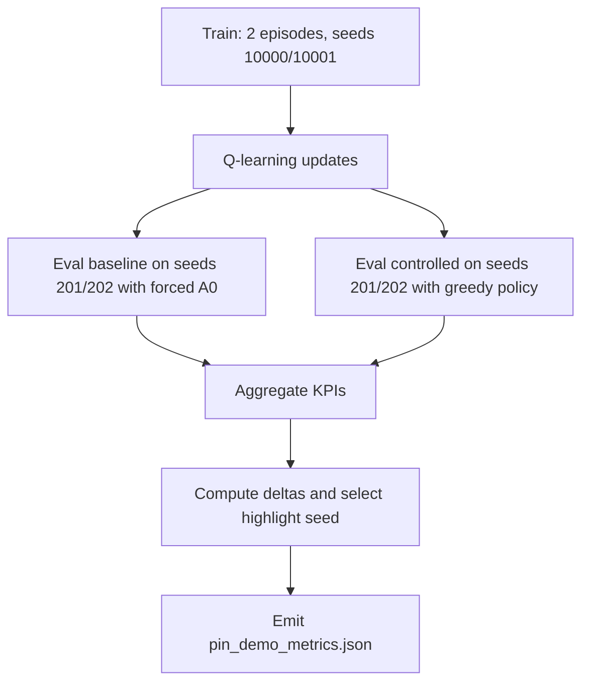
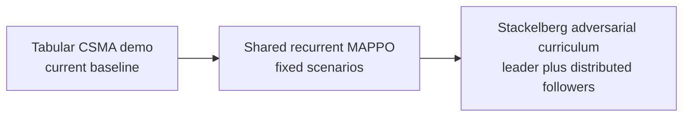

# PIN Optimal-Control Experiment (CSMA Demo)

This runbook documents the optimal-control style PIN experiment implemented in:

- `crates/radio-sim-core/examples/pin_csma_demo.rs`
- `experiments/pin_csma_demo.py`

## Purpose

Demonstrate that local PIN control can improve scenario outcomes versus a neutral baseline without changing waveform internals.

This demo is the current CSMA-only baseline for the learning stack. It does not yet include TDMA learning, and it does not yet require a runtime API change.

## Experiment Flow



## Learning Progression

The current tabular demo is the first rung of the learning ladder. The intended progression is:

1. tabular CSMA control on the existing `LocalObservation` and `LocalAction` boundary
2. shared recurrent MAPPO over fixed scenarios, still using the same CSMA action surface
3. Stackelberg adversarial curriculum training, with an adversarial scenario leader and decentralized radio followers



The key constraint is that the first learning claim remains CSMA-only:

- TDMA is out of scope for the first learned-policy milestone.
- The same controller scaffold can later be reused for TDMA once that action path is implemented end-to-end.
- The learning stack should be interpreted as a progression from this experiment, not a replacement for it.

## Fixed Experiment Configuration

From `build_config(seed)` in `pin_csma_demo.rs`:

- Nodes: `8`
- Area: `150 m`
- Duration: `1.5 s`
- MAC: CSMA
- Queue size: `6`
- Traffic model: Bernoulli, `packet_bits = 1024`
- Class mix: command `0.15`, voice `0.25`, best_effort `0.60`
- Overlay enabled: yes
- Control interval: `250 ms`

## Policy/Control Design

- Policy class: tabular Q-learning.
- State bins from local observations:
  - `q_bin` from high-priority queue size
  - `busy_bin` from CCA busy fraction
  - `drop_bin` from high-priority drops
- Action space: 4 templates:
  - `A0`: neutral (`LocalAction::default()`)
  - `A1`: aggressive-priority
  - `A2`: balanced
  - `A3`: conservative

Reward used in training:

```text
r = 2.5 * high_pdr + 0.03 * high_deliveries - 0.015 * high_p95_ms - 0.05 * high_drops
```

## Train/Eval Protocol

- Train episodes: `2`
- Train seeds: `10000`, `10001`
- Epsilon schedule: `epsilon = max(0.35 - 0.012 * ep, 0.05)`
- Q-update: `alpha = 0.22`, `gamma = 0.90`

Evaluation (A/B):

- Eval seeds: `201`, `202`
- Baseline: forced neutral action (`A0`)
- Controlled: greedy policy from trained table

## Reproduce End-to-End

From repository root:

```bash
python3 radio-sim/experiments/pin_csma_demo.py
MPLCONFIGDIR=/tmp/mpl python3 radio-sim/experiments/generate_pin_demo_visuals.py
python3 radio-sim/experiments/build_pin_demo_deck.py
```

## Outputs

- `docs/pin_demo_metrics.json`
- `docs/figures/pin_demo/aggregate_kpi_comparison.png`
- `docs/figures/pin_demo/seed_level_pairwise.png`
- `docs/figures/pin_demo/highlight_seed_trace_kpis.png`
- `docs/figures/pin_demo/highlight_seed_mechanism.png`
- `docs/figures/pin_demo/highlight_seed_action_usage.png`
- `docs/pin_local_control_results_deck.pptx`

Interpretive report:

- `docs/pin_demo_results.md`

## Result Payload Structure

Top-level fields in `pin_demo_metrics.json`:

- `config`
- `baseline[]`
- `controlled[]`
- `baseline_mean`
- `controlled_mean`
- `delta`
- `seed_scenarios[]`
- `highlight_seed`
- `highlight_reason`

## Limitations of This Run

- Small sample (`2` eval seeds).
- Demonstration objective/reward is heuristic and latency-weighted.
- CSMA-only control effects; TDMA local action path is currently a no-op.
- This is not yet the shared recurrent MAPPO or adversarial Stackelberg training regime.

## Recommended Next Expansion

- Increase eval seed count and report confidence intervals.
- Sweep alternative reward weights and action templates.
- Add stress scenarios (higher node density/load/interference).
