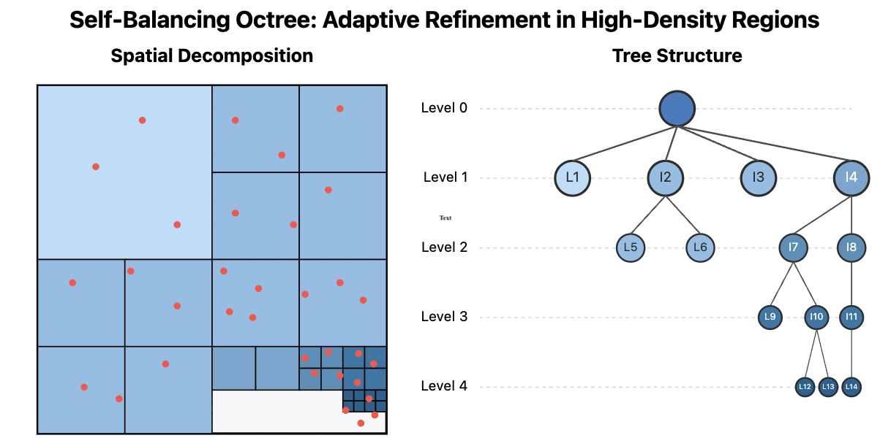
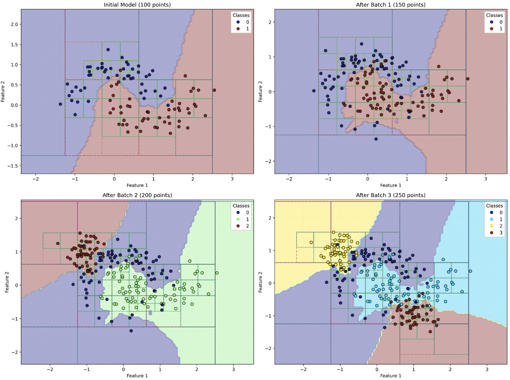
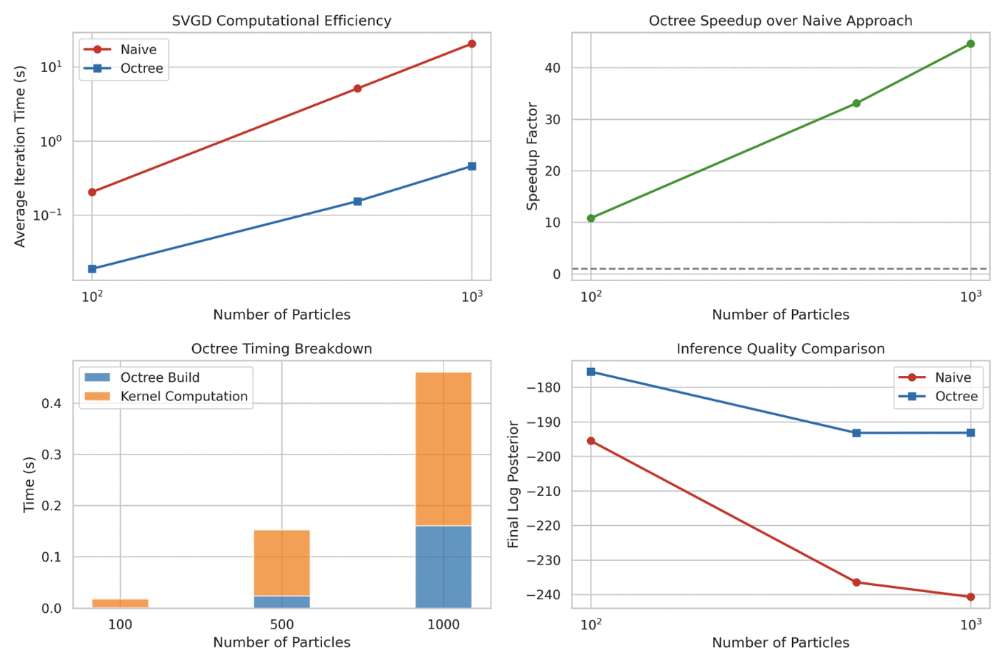
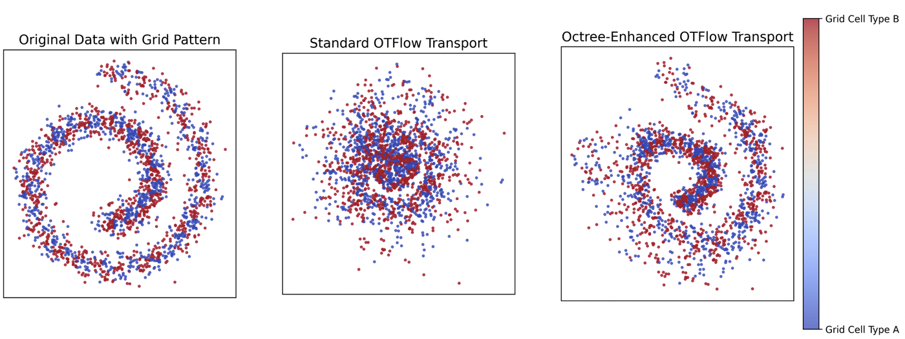

# Self-balancing, Memory Efficient, Dynamic Metric Space Data Maintenance, for Rapid Multi-kernel Estimation

### ECML PKDD 2025

**Aditya S Ellendula, Chandrajit Bajaj**

The University of Texas at Austin

[Paper](https://arxiv.org/pdf/2504.18003.pdf) &nbsp; | &nbsp; [arXiv:2504.18003](https://arxiv.org/abs/2504.18003)

---



_**Adaptive refinement of the $(K, \alpha)$ dynamic octree.** The spatial view (left) and the corresponding tree structure (right) refine only where local density demands it, so depth is spent where the data actually is._

---

### TL;DR

> **Learning systems are dynamical systems.** Their trajectories through high-dimensional spaces require efficient importance sampling for optimal convergence, and their latent representations cannot be learned in one shot — they grow and evolve sequentially during training.
>
> We present a dynamic self-balancing octree that provides a **computational fabric** organizing both the generation flow and the querying flow, enabling **logarithmic-time updates and queries without complete rebuilding** as distributions evolve.

---

### The Maintenance Challenge in Generative Spaces

The efficacy of generative models depends on their ability to navigate and query high-dimensional metric spaces: repeated nearest-neighbor searches, importance sampling, and density estimation — operations that become exponentially more expensive as dimensions and data sizes increase.

Traditional spatial indexing faces a fundamental dilemma. Structures must either **rebuild entirely** when distributions change, incurring substantial overhead, or **accept increasingly suboptimal performance**. This is acute in three settings:

- **Dynamic training processes** — modern generative models undergo continuous distribution shifts, with each epoch a path through parameter space requiring efficient importance sampling.
- **Online learning** — systems incorporating new data must update their generative understanding without retraining from scratch.
- **Adaptive inference** — particle-based variational inference must maintain spatial relationships between particles as they collectively transform toward a target distribution.

KD-trees and R-trees optimize for either query efficiency or update performance, but rarely both.

---

### Our Approach: A Two-Parameter $(K, \alpha)$ Dynamic Octree

- **Two-parameter adaptivity** — a $(K, \alpha)$ parameterization that automatically balances the structure based on local data density.
- **Memory efficiency** — reduced footprint through adaptive node capacity and efficient spatial partitioning.
- **Dynamic rebalancing** — continuous adaptation to distribution shifts without complete rebuilding.

Unlike traditional octrees, the structure provides **guaranteed logarithmic-time bounds for both update and query operations** as distributions evolve. When new points are inserted, only affected branches require modification, and rebalancing is performed locally rather than globally.

Against i-Octree, kd-tree, ikd-Tree, and R\*-tree, the structure is the only one in the comparison offering dynamic insertion and deletion, full self-balancing, adaptive node capacity, and multi-resolution queries simultaneously.

---

### Four Applications

#### 1. Incremental KNN classification



_**Adaptive spatial partitioning in incremental KNN classification.** Panels show the classifier as new labeled batches arrive; the octree refines locally around emerging class boundaries instead of rebuilding._

| Dataset size | scikit-learn update (s) | Octree update (s) | scikit-learn accuracy | Octree accuracy |
| -----------: | ----------------------: | ----------------: | --------------------: | --------------: |
|       10,000 |                  0.0768 |        **0.0138** |                89.23% |          89.07% |
|       20,000 |                  0.1685 |        **0.0221** |                90.18% |          90.12% |
|       30,000 |                  0.2743 |        **0.0312** |                90.87% |          90.85% |
|       40,000 |                  0.3821 |        **0.0412** |                91.43% |          91.35% |
|       50,000 |                  0.4947 |        **0.0524** |                91.96% |          91.88% |

Update speedups range from **5.6× at 10,000 points to 9.4× at 50,000 points**, with update time scaling as $O(\log n)$ rather than scikit-learn's $O(n^2)$. Query speedups are 1.6×–1.9× — notable because improved update efficiency usually costs query performance. Accuracy stays within **0.2%** across all dataset sizes, confirming that the essential nearest-neighbor relationships are preserved.

#### 2. Octree-accelerated SVGD for Bayesian inference



_**Octree-accelerated SVGD versus a naive implementation.** The approach converges faster in wall-clock time and reaches better posterior approximations, particularly at larger particle counts._

Stein Variational Gradient Descent is bottlenecked by the $O(n^2)$ cost of pairwise kernel interactions. The octree reduces this to $O(n \log n)$, with speedup factors reaching **40× at 1,000 particles**. More importantly, inference quality _improves_ with scale while the naive approach degrades, due to numerical issues from many small kernel interactions. This enables accurate uncertainty quantification with **10× more particles** than previously feasible.

#### 3. Retrieval-augmented generation with evolving knowledge

New documents are inserted with $O(\log n)$ complexity rather than the $O(n)$ of traditional approaches, achieving **4.2× faster semantic retrieval** while maintaining retrieval accuracy comparable to Annoy. Search time scales logarithmically while competitors exhibit linear or super-linear growth — a shift from batch rebuilding to incremental maintenance.

#### 4. Dual-space optimal transport flow



_**Structure preservation in 2D transport.** Left: original grid-colored distribution. Middle: standard OT-Flow, showing significant distortion of local neighborhoods. Right: the octree-enhanced approach, preserving the grid pattern and local relationships._

Maintaining **both input and latent space representations simultaneously** yields faster convergence and improved sample efficiency compared to optimizing one space at a time:

- **Structure preservation** — 89.6% improvement in neighborhood Jaccard similarity (0.787 vs. 0.415).
- **Model quality** — reconstruction error down 83% ($1.78\times10^{-6} \rightarrow 3.05\times10^{-7}$); trajectory smoothness up 69% (curvature $0.00181 \rightarrow 0.00056$).

---

### Abstract

We present a dynamic self-balancing octree data structure that fundamentally transforms neighborhood maintenance in evolving metric spaces. Learning systems, from deep networks to reinforcement learning agents, operate as dynamical systems whose trajectories through high-dimensional spaces require efficient importance sampling for optimal convergence. Generative models operate as dynamical systems whose latent representations cannot be learned in one shot, but rather grow and evolve sequentially during training — requiring continuous adaptation of spatial relationships.

Our two-parameter $(K, \alpha)$ dynamic octree addresses this challenge by providing a computational fabric that efficiently organizes both the generation flow and querying flow operating on different time scales, by enabling logarithmic-time updates and queries without requiring complete rebuilding as distributions evolve.

We demonstrate its efficacy in four significant machine learning applications. First, in Stein's variational gradient descent, our structure enables processing substantially more particles with dramatically reduced computational overhead, improving posterior approximation quality. Second, for incremental KNN-based classification with dynamic updates, we achieve logarithmic query time compared to the quadratic complexity of standard methods. Third, for retrieval-augmented generation with evolving knowledge bases, our approach enables efficient incremental document indexing and semantic retrieval without rebuilding embedding indexes. Fourth, our experiment demonstrates that maintaining both input and latent space representations simultaneously yields significantly faster convergence and improved sample efficiency compared to traditional approaches that optimize only one space at a time.

Across all applications, our experimental results confirm exponential performance improvements over standard methods while maintaining accuracy. By providing guaranteed logarithmic bounds for both update and query operations, our approach enables more data-efficient solutions to previously computationally prohibitive problems, establishing a new approach to dynamic spatial relationship maintenance in machine learning.

---

### BibTeX

```bibtex
@inproceedings{ellendula2025selfbalancing,
  title     = {Self-balancing, Memory Efficient, Dynamic Metric Space Data Maintenance, for Rapid Multi-kernel Estimation},
  author    = {Ellendula, Aditya S and Bajaj, Chandrajit},
  booktitle = {Joint European Conference on Machine Learning and Knowledge Discovery in Databases (ECML PKDD)},
  year      = {2025},
  url       = {https://arxiv.org/abs/2504.18003}
}
```

---

### People

- Aditya Sai Ellendula
- [Chandrajit Bajaj](https://www.cs.utexas.edu/~bajaj/)

### Related Work at CVC

- [GRL-SNAM: Geometric Reinforcement Learning for Simultaneous Navigation and Mapping](/projects/grl-snam)
- [Scalable Robust Bayesian Co-Clustering with Compositional ELBOs](/projects/scalable-robust-bayesian-co-clustering)
