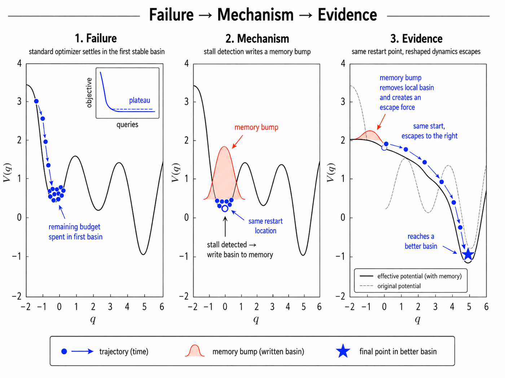
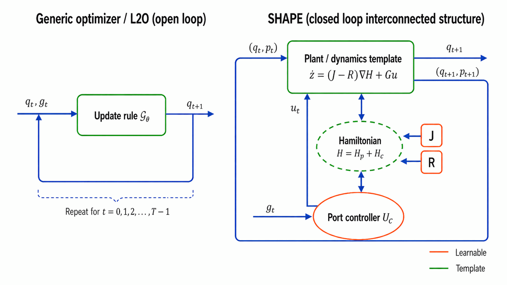
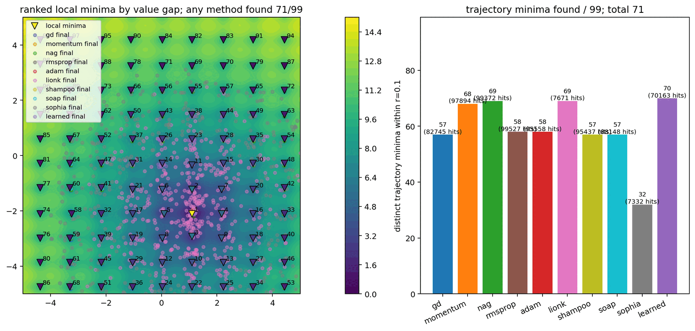

# When Descent Is Too Stable: Event-Triggered Hamiltonian Learning to Optimize

**Yi Wang<sup>1</sup>, Chandrajit Bajaj<sup>1,2</sup>**

<sup>1</sup>Oden Institute, The University of Texas at Austin<br />
<sup>2</sup>Department of Computer Science, The University of Texas at Austin

[Paper](https://arxiv.org/pdf/2605.06868.pdf) &nbsp; | &nbsp; [arXiv:2605.06868](https://arxiv.org/abs/2605.06868)

---



_**Failure → Mechanism → Evidence.** A local descent method may terminate at the first stable critical point encountered from a short-sighted trajectory. SHAPE records such events in memory and uses the resulting shaped energy to discourage repeated refinement of already explored basins._

---

### TL;DR

> **Fixed-budget nonconvex optimization can fail not because local descent is unstable, but because it is _too stable_.**
>
> After reaching a nearby stationary point, an optimizer may spend the remaining evaluations refining an uninformative local minimum. We formulate this failure mode as a control problem over optimizer dynamics, where the learner must decide when to descend, when to exploit a promising basin, and when stagnation should trigger movement elsewhere.

---

### The Failure Mode

Descent update rules are provably stable and find the desired global minimum when the objective is convex or strongly convex. But that guarantee hides a central difficulty of nonconvex optimization under a limited budget: **local descent can be too stable.** Once the update reaches a nearby attractive critical point, the remaining evaluations may be spent refining a basin that is irrelevant to the best solution available under the same budget.

A fixed gradient-descent scheme is not able to decide when local descent is useful, when momentum should be dissipated, when a stable basin should be recorded, and when the next stage should be redirected elsewhere. Classical adaptive optimizers — momentum, NAG, RMSProp, Adam, and related variance-reduction schemes — provide important first-order mechanisms, but their deployment-time update laws are still largely fixed.

---

### SHAPE: Structured Hamiltonian Adaptive Port Evaluation

SHAPE lifts the optimizer state from $q \in \mathcal{Q}$ to $x = (q, p) \in T^*\mathcal{Q}$. The momentum $p$ is a covector conjugate to $q$, so the optimizer evolves in a **phase space** rather than by a primal update alone. At event stage $s$, memory $m_s$ and a local anchor $\bar{q}_s$ define a shaped potential

$$
U_s^\text{shp}(q) = U_\eta(q; m_s) + \frac{\kappa_s}{2}\|q - \bar{q}_s\|^2 + V_{\text{bar},s}(q; m_s, \mu_s),
$$

with local Hamiltonian $H_{s,k}(q,p) = f(q) + U_s^\text{shp}(q) + \tfrac{1}{2} p^\top M_k^{-1} p$. The memory term summarizes previously visited basins, the quadratic term gives a local stage anchor, and the optional barrier term discourages repeated refinement of excluded regions.



_**Open loop versus closed loop.** A generic learned optimizer maps local oracle information directly to the next iterate, whereas SHAPE implements a closed-loop port-Hamiltonian interconnection. The plant state $(q_k, p_k)$ evolves under the shaped Hamiltonian; the learned controller selects the structured operator, damping/interconnection gains, and bounded port input._

**Two time scales.** Within a stage, the frozen shaped Hamiltonian induces dissipative phase-space transport. Across stages, an event interface updates memory, mode, anchor, and budget. This differs from an open-loop learned optimizer $x_{k+1} = G(x_k, g(q_k); \psi)$: SHAPE couples a plant and controller through power-conjugate ports, so the learned update acts through a structured port channel rather than through an unconstrained coordinate update. The design preserves a passivity-compatible structure while allowing the same trained policy to use clean, stochastic, or estimated gradient inputs.

---

### Contributions

1. **Event-triggered formulation.** Fixed-budget nonconvex optimization as a task-family minima hunter on $T^*\mathcal{Q}$, with a unified shaped potential and an explicit split between shaping input, port input, and damping injection.
2. **A practical optimizer.** SHAPE for clean-gradient, stochastic-gradient, and value-only oracle inputs, using the local port-Hamiltonian template with energy-balance diagnostics for noise, port work, and discretization defects.
3. **Finite-budget analysis.** Supporting results on frozen-stage hypocoercive contraction, discrete contraction, hybrid memory-assisted improvement, and stochastic-oracle energy perturbations, evaluated on synthetic, physics-based, and control-oriented nonconvex task families.

---

### Results

All learned parameters are frozen at test time and evaluated zero-shot on held-out tasks; classical baselines are run under matched oracle-query budgets. For each family, the baseline row is the strongest classical baseline selected by average BestGap.

| Family          | Dim.            | Method           | Final gap ↓ | Best gap ↓  | Hit rate ↑ |
| --------------- | --------------- | ---------------- | ----------- | ----------- | ---------- |
| Multi-well      | 1               | **SHAPE / full** | **0.987**   | **0.477**   | **0.602**  |
| Multi-well      | 1               | Momentum         | 1.290       | 1.115       | 0.300      |
| Ackley          | 2, 20, 100, 500 | **SHAPE / full** | **0.679**   | **0.323**   | **0.486**  |
| Ackley          | 2, 20, 100, 500 | NAG              | 1.71        | 1.31        | 0.389      |
| Lévy            | 2, 20, 100, 500 | **SHAPE / full** | **0.074**   | **0.0427**  | 0.227      |
| Lévy            | 2, 20, 100, 500 | RMSProp          | 0.202       | 0.202       | **0.533**  |
| Lennard–Jones   | 6, 18           | **SHAPE / full** | **0.254**   | **0.113**   | **0.190**  |
| Lennard–Jones   | 6, 18           | RMSProp          | 0.519       | 0.519       | 0.000      |
| Phase retrieval | 8, 32           | **SHAPE / full** | **0.00601** | **0.00351** | **0.631**  |
| Phase retrieval | 8, 32           | NAG              | 0.040       | 0.040       | 0.000      |
| Control trajopt | 8, 32           | SHAPE / full     | 2.49        | **0.106**   | **0.316**  |
| Control trajopt | 8, 32           | RMSProp          | **1.33**    | 1.33        | 0.002      |

SHAPE improves BestGap and hit rate on the multi-well study, Ackley, low-to-moderate Lévy summaries, Lennard–Jones, phase retrieval, and the control best-so-far metric. The same table exposes two limitations honestly: coordinate-adaptive baselines remain very strong on high-dimensional **separable** analytic functions (most visibly Rastrigin, where RMSProp dominates), and in control trajectory optimization SHAPE attains a better best-so-far objective but not the best terminal objective — the controller discovers good regions before fully stabilizing to them within the fixed budget.



_**Minima finding over 512 random initializations.** Left: ranked local minima by value gap on one sampled Ackley task instance. Right: distinct trajectory minima found by each optimizer. SHAPE traverses the landscape so that each search trajectory is more informative than fixed gradient-descent methods._

**Budget ablation.** Holding the total per-task rollout budget fixed at $N_\text{part} B = 32{,}768$, SHAPE remains competitive across all settings and improves as evaluation covers more tasks or allocates longer per-particle rollouts: best-seen gap falls from $2.2\times10^{-4}$ to below $10^{-10}$, while trajectory hit rate rises from 40.0% to 72.7%.

**Controller ablation.** Removing the local interconnected controller substantially worsens the best-seen gap in every reported dimension (Ackley $d{=}2$: 0.794 → 2.865; $d{=}100$: 0.001 → 0.685), indicating that the learned controller is not merely adding parameters but contributes to the navigation policy.

---

### Abstract

Fixed-budget nonconvex optimization can fail not because local descent is unstable, but because it is too stable: after reaching a nearby stationary point, an optimizer may spend the remaining evaluations refining an uninformative local minimum. We formulate this failure mode as a control problem over optimizer dynamics, where the learner must decide when to descend, when to exploit a promising basin, and when stagnation should trigger movement elsewhere.

We introduce SHAPE, a structured adaptive port-Hamiltonian task-family optimizer for event-triggered minima hunting under local information. Starting from gradient-descent dynamics, SHAPE lifts optimization to an augmented phase space $(q, p)$, where the primal state $q$ represents the candidate solution, the cotangent variable $p$ carries directional sensitivity, and a controller $u$ provides processed information from the current gradient oracle. Within each stage, a learned Hamiltonian vector field induces structured local descent; across stages, a fixed event clock updates ports and memory when local equilibria are detected. This design preserves a passivity-compatible structure while allowing the same trained policy to use clean, stochastic, or estimated gradient inputs.

Experiments on fixed-budget nonconvex optimization tasks show that SHAPE improves best-so-far performance compared with fixed-policy optimizers. These results suggest that adaptive Hamiltonian energy shaping provides a principled mechanism for balancing descent, exploration, and budget allocation in difficult optimization landscapes.

---

### Limitations

In high-dimensional spaces, online gradient-descent variants are often preferred and have proved practically effective for training overparameterized models. Although the method supports compressed memory independently of the ambient parameter dimension, information loss — especially validation of vector-field topology — is intractable in the current implementation. How to decompose high-dimensional state spaces and perform efficient updates remains an open research question, as does incorporating uncertainty quantification into the controller.

---

### BibTeX

```bibtex
@article{wang2026descent,
  title   = {When Descent Is Too Stable: Event-Triggered Hamiltonian Learning to Optimize},
  author  = {Wang, Yi and Bajaj, Chandrajit},
  journal = {arXiv preprint arXiv:2605.06868},
  year    = {2026},
  url     = {https://arxiv.org/abs/2605.06868}
}
```

---

### People

- Yi Wang
- [Chandrajit Bajaj](https://www.cs.utexas.edu/~bajaj/)

### Related Work at CVC

- [Material-Aware Hamiltonian Risk Fields for Safe Navigation](/projects/material-aware-hamiltonian-risk-fields)
- [PHAST: Port-Hamiltonian Architecture for Structured Temporal Dynamics Forecasting](/projects/phast)
