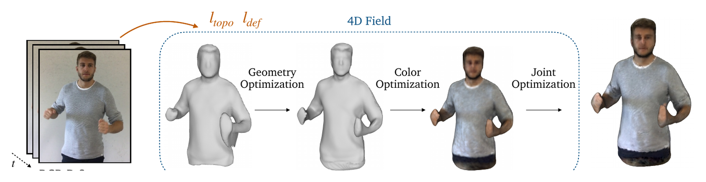
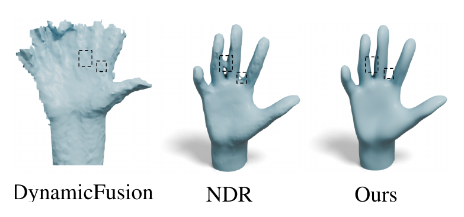
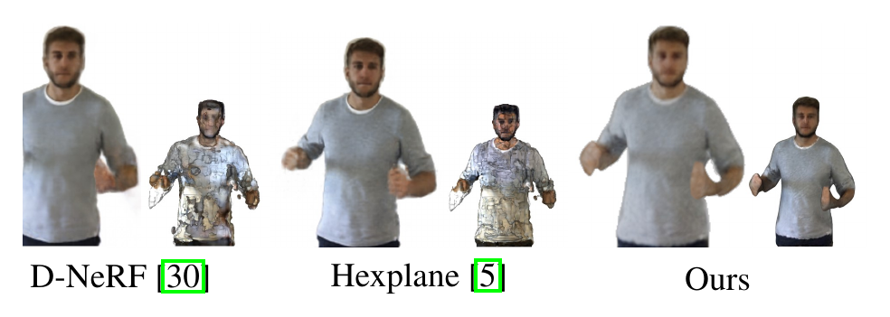

# 4DRecons: 4D Neural Implicit Deformable Objects Reconstruction from a Single RGB-D Camera with Geometrical and Topological Regularizations

**Xiaoyan Cong<sup>1</sup>\*, Haitao Yang<sup>2</sup>, Liyan Chen<sup>2</sup>, Kaifeng Zhang<sup>3</sup>, Li Yi<sup>4</sup>, Chandrajit Bajaj<sup>2</sup>, Qixing Huang<sup>2</sup>†**

<sup>1</sup>Zhejiang University &nbsp;·&nbsp; <sup>2</sup>The University of Texas at Austin &nbsp;·&nbsp; <sup>3</sup>University of Illinois Urbana-Champaign &nbsp;·&nbsp; <sup>4</sup>Tsinghua University

<sup>\*</sup>Work done while an intern at The University of Texas at Austin. &nbsp; <sup>†</sup>Corresponding author.

[Paper](https://arxiv.org/pdf/2406.10167.pdf) &nbsp; | &nbsp; [arXiv:2406.10167](https://arxiv.org/abs/2406.10167)

---



_**Pipeline overview of 4DRecons**, which performs a four-stage optimization procedure. The first stage initializes the geometry field by fitting the input data. The second stage enforces deformation and topology regularizations to improve the geometry field. The third stage initializes the color field while fixing the geometry field. The last stage jointly refines the geometry field and the color field._

---

### TL;DR

> **A single RGB-D sequence in, a complete textured deforming 3D model out.**
>
> 4DRecons encodes the output as a 4D neural implicit surface and combines a data term with two regularization terms: deformation among adjacent frames should be **as rigid as possible**, and the topology of the underlying object should remain **fixed over time**. The topology term is what removes the self-intersections typical of implicit-based reconstructions.

---

### The Problem

Reconstructing a deforming object from a single RGB-D sensor has been studied for decades. Early approaches align and merge frames, but errors accumulate and penetrations and self-intersections are difficult to address. Recent approaches leverage deep networks for non-rigid registration and fusion — yet inter-penetrations and self-intersections remain a glaring issue.

4DRecons instead formulates 4D dynamic reconstruction as **learning a 4D implicit field** — iso-value of surface and colors — from partial RGB-D scans, motivated by the success of implicit neural representations for both static and dynamic objects and scenes.

---

### Method

**Data term.** The data term fits the 4D implicit surface to the input partial observations. A fundamental challenge is defining this term so that it remains well posed _even when the observation is partial_, which 4DRecons addresses directly.

**Deformation regularization ($l_\text{def}$).** The first regularization term enforces that deformation among adjacent frames is as rigid as possible (ARAP), and that deformations are smooth among triplets of frames. This requires a novel approach to compute correspondences between adjacent **textured implicit surfaces**, which are then used to define the ARAP term. This is how partial observations are propagated across the whole sequence — without it, propagation relies on network smoothness, which does not understand the underlying approximate articulated motions.

**Topology regularization ($l_\text{topo}$).** The second term — a key contribution — enforces that the topology of the reconstruction remains fixed over time by aligning the persistence diagram throughout the sequence. Combined with the implicit-field representation, this addresses the open problem of obtaining **self-intersection-free reconstructions** under explicit representations such as a deforming SMPL model.

---

### Results

Evaluated on DeepDeform (D_D), KillingFusion (K_F), and our own collected data (O_D). Geometry error is the difference between the reconstructed mesh and depth values inside the mask; color is PSNR between rendering results and masked input RGB.

| Method              | RGB | Depth | Geom. D_D ↓ | Geom. K_F ↓ | Geom. O_D ↓ | Color D_D ↑ | Color K_F ↑ | Color O_D ↑ |
| ------------------- | :-: | :---: | ----------: | ----------: | ----------: | ----------: | ----------: | ----------: |
| D-NeRF              |  ✓  |   ⊙   |       2.891 |       3.139 |       4.912 |       28.78 |       27.73 |       22.86 |
| Hexplane            |  ✓  |   ⊙   |       2.319 |       2.968 |       4.628 |       32.79 |       31.28 |       27.11 |
| DynamicFusion       |  ×  |   ✓   |       5.428 |       4.129 |       14.19 |           — |           — |           — |
| NDR                 |     |   ✓   |       0.923 |       1.323 |       1.899 |       31.08 |   **30.92** |       25.09 |
| **4DRecons (ours)** |  ✓  |   ✓   |   **0.884** |   **1.249** |   **1.823** |   **32.04** |       30.17 |   **27.72** |

_Geometry in mm (lower is better); color in PSNR dB (higher is better)._

4DRecons reduces the mean reconstruction error of D-NeRF, Hexplane, DynamicFusion, and NDR by an average of **64.17%, 60.14%, 80.21%, and 4.45%** respectively across all datasets.



_**Sequences with topology changes.** The topology regularization term keeps the reconstruction topology fixed and consistent over time. Baselines produce inconsistent topology — different parts of fingers randomly merge when they come close to each other. DynamicFusion also exhibits artifacts around the surface, and NDR fails to recover the underlying approximate articulated deformation under large deformation and fast motion._



_**Color field.** The center of each panel is the rendering result and the lower-right corner is the colored mesh. Rendering quality is on par with baselines trained via volume rendering, but the extracted **textured mesh** is significantly more detailed and sharper — encouraging, because NeRF-based techniques tend to overfit training data and show artifacts under novel viewpoints and poses. A textured mesh also enables fast rendering and many downstream applications._

**Ablation.** Removing each component in turn, the four-stage optimization procedure provides the largest quantitative benefit and is essential for convergence, followed by the deformation regularization term, the color consistency term, and the topology regularization term. Each plays its own role in enhancing geometry and color field reconstruction.

---

### Abstract

This paper presents a novel approach 4DRecons that takes a single camera RGB-D sequence of a dynamic subject as input and outputs a complete textured deforming 3D model over time. 4DRecons encodes the output as a 4D neural implicit surface and presents an optimization procedure that combines a data term and two regularization terms. The data term fits the 4D implicit surface to the input partial observations. We address fundamental challenges in fitting a complete implicit surface to partial observations.

The first regularization term enforces that the deformation among adjacent frames is as rigid as possible (ARAP). To this end, we introduce a novel approach to compute correspondences between adjacent textured implicit surfaces, which are used to define the ARAP regularization term. The second regularization term enforces that the topology of the underlying object remains fixed over time. This regularization is critical for avoiding self-intersections that are typical in implicit-based reconstructions.

We have evaluated the performance of 4DRecons on a variety of datasets. Experimental results show that 4DRecons can handle large deformations and complex inter-part interactions and outperform state-of-the-art approaches considerably.

---

### Limitations

The approach assumes the final reconstruction is a **closed** deforming surface, and requires that each point of the underlying object be observed from at least one frame; unsigned distance fields that model open surfaces are a natural extension. The topology regularization term improves topological consistency but cannot guarantee that the topology of the reconstruction remains fixed, since it is enforced softly.

---

### BibTeX

```bibtex
@article{cong20244drecons,
  title   = {4DRecons: 4D Neural Implicit Deformable Objects Reconstruction from a Single RGB-D Camera with Geometrical and Topological Regularizations},
  author  = {Cong, Xiaoyan and Yang, Haitao and Chen, Liyan and Zhang, Kaifeng and Yi, Li and Bajaj, Chandrajit and Huang, Qixing},
  journal = {arXiv preprint arXiv:2406.10167},
  year    = {2024},
  url     = {https://arxiv.org/abs/2406.10167}
}
```

---

### People

- Xiaoyan Cong
- Haitao Yang
- Liyan Chen
- Kaifeng Zhang
- Li Yi
- [Chandrajit Bajaj](https://www.cs.utexas.edu/~bajaj/)
- Qixing Huang
