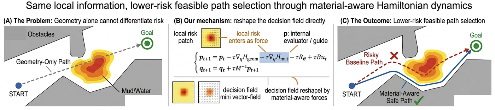
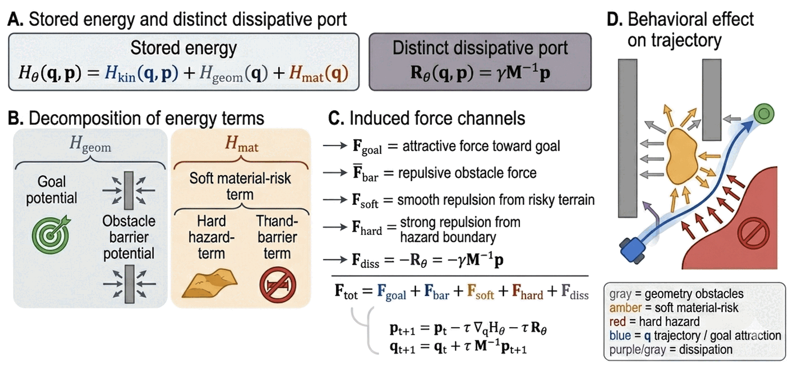
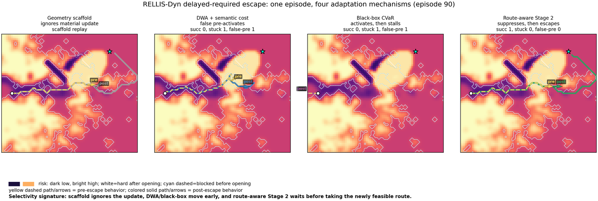

# Learning Material-Aware Hamiltonian Risk Fields for Safe Navigation

**Aditya Sai Ellendula<sup>1</sup>, Yi Wang<sup>2</sup>, Chandrajit Bajaj<sup>1,2</sup>**

<sup>1</sup>Department of Computer Science, The University of Texas at Austin<br />
<sup>2</sup>Oden Institute, The University of Texas at Austin

[Paper](https://arxiv.org/pdf/2605.07038.pdf) &nbsp; | &nbsp; [arXiv:2605.07038](https://arxiv.org/abs/2605.07038)

---



_**Selective reshaping of the decision field.** (A) Geometrically feasible maneuvers can differ in material risk. (B) Adding the context-energy gradient to the cotangent update creates a context-force channel. (C) The channel bends toward a safer lane when one is feasible, but remains negligible when escape is boxed in._

---

### TL;DR

Risk-aware navigation should be **selective**: a policy should expose evasive degrees of freedom only when the local scene admits a lower-risk feasible maneuver, and suppress them when no safer alternative exists. We show that adding **one context-energy term** to a port-Hamiltonian navigation policy produces a learned force channel with exactly this falsifiable signature.

---

### The Selectivity Gap

When a lower-risk feasible maneuver exists, the robot should expose the evasive degree of freedom and take it; when the apparent escape is blocked, corrupted, or not yet open, it should suppress that same degree of freedom rather than hallucinate a detour. Classical planners, MPC/MPPI-style samplers, reactive controllers, and learned policies all address parts of this problem, but none make this activation/suppression asymmetry an explicit structural property: risk costs tend either to pull everywhere a gradient exists, causing false maneuvers, or to be damped enough that the system misses real escape opportunities.

The issue is acute in off-road terrain and local traffic. A patch that looks clear from geometry alone may be wet clay; a corridor that looks low-risk in the semantic map may be physically blocked; a lane change may be useful behind a slow leader but unsafe when the adjacent lane is boxed in. The agent must decide **which force channels should be active** under the current local context, and which should remain latent.

---

### Method: One Additive Energy Term

The geometry-only policy and the context-enriched field share the same phase-space update. The only dynamical addition is the context-force term in the momentum equation:

$$
p_{t+1} = p_t - \tau \nabla_q H_\text{geom} \; \mathbf{- \tau \nabla_q H_\text{ctx}} \; - \tau R_\theta(p_t), \qquad q_{t+1} = q_t + \tau M^{-1} p_{t+1}
$$

New sensory information therefore enters through the cotangent variable $p$, not through a separate critic or global replanner. **The decision field is the policy**: changing the stored energy changes the vector field that generates the next motion.



_**Factored stored energy and induced force channels.** The stored energy separates kinetic, geometric, dissipative, and context terms. The context term creates a soft-risk deflection channel and a hard-hazard repulsion channel. The route-aware gate lets the soft channel shift the field only when a feasible lower-risk maneuver exists; otherwise the rollout stays near the geometry-only policy._

Differentiating $H_\text{ctx}$ yields two force channels: $F_\text{soft}$, a lateral risk deflection expressing preferences among feasible maneuvers, and $F_\text{hard}$, a differentiable penalty against boundary contact. Risk is therefore not a post-hoc cost, but a force that reshapes the local closed-loop dynamics.

**Route-aware gate.** The scalar soft-risk force can overreact when a low-risk-looking region is blocked by a fence, berm, or vehicle. We gate only the soft-risk channel with a local affordance test over $K{=}8$ short-horizon primitives sampled inside the current BEV patch. The soft channel opens only if the best feasible primitive improves soft risk by margin $\rho_R$, clears the SDF, and is locally traversable. If any test fails, $F_\text{soft}$ is suppressed while $F_\text{hard}$ remains active. The test is local and differentiable, and does not call a global planner.

**Tail-risk objective.** Because the relevant failures are rare, expected-cost training can be dominated by typical rollouts. We optimize the empirical Rockafellar–Uryasev CVaR objective with $\alpha = 0.95$ and $B = 64$, so gradient flows through the worst rollouts and acts exactly on those where the context force can change the outcome.

---

### Selectivity Is Structural, Not Tuned

Proposition 1 formalizes the coupling: enrichment is not merely a new cost term, but a coordinated enlargement of the force field, learning pathway, and update timescale. Over any finite horizon:

- **C1 — Geometry-only preservation.** If the context force stays below $\varepsilon$, the context-enriched rollout remains within $O(\varepsilon)$ of the geometry-only rollout.
- **C2 — No hallucinated escape.** If the lateral component stays below $\varepsilon_\perp$, lateral deviation from the geometry-only rollout is bounded by $O(\varepsilon_\perp)$.
- **C3 — Selective risk deflection.** Given a feasible lateral direction with projected risk-gradient margin $\Delta$, one semi-implicit step decreases local soft risk by $O(\tau^2 \lambda_s \Delta^2)$ whenever $\lambda_s \Delta > \chi$.

C1–C3 follow from the gradient structure of $H_\text{ctx}$ and the affordance gate, not from post-hoc tuning.

---

### Results

**Primary head-to-head: delayed required escape.** The lateral maneuver is blocked early, necessary later, and must be timed without global replanning. All methods receive the same updated BEV patch at every step; only the decision mechanism differs.

| Method                    | False pre-act ↓ | Suppress ↑ | Success ↑ | Viol. CVaR ↓ |
| ------------------------- | --------------- | ---------- | --------- | ------------ |
| Geometry-only policy      | 0.000           | 1.000      | 0.030     | 1.894        |
| Risk-loss-only            | 0.420           | 0.580      | 0.040     | 1.793        |
| Fixed-coeff context field | 0.990           | 0.010      | 0.030     | 0.463        |
| Black-box CVaR policy     | 0.920           | 0.080      | 0.200     | 0.503        |
| DWA semantic              | 0.950           | 0.050      | 0.480     | 0.695        |
| MPPI semantic             | 0.950           | 0.050      | 0.240     | 0.831        |
| Ctx-enriched, expected    | 0.370           | 0.630      | 0.620     | 0.855        |
| **Route-aware Ctx CVaR**  | **0.180**       | **0.820**  | **0.810** | 0.740        |

Route-aware CVaR reduces DWA and semantic MPPI false pre-activation from 0.950 to **0.180** while raising success from 0.480/0.240 to **0.810**, with **zero replans**.



_**Qualitative temporal selectivity in one delayed-required escape episode.** Yellow dashed trajectories show behavior before the escape is available; solid colored trajectories show behavior after it opens. The geometry-only policy ignores the material update, DWA and black-box CVaR move before the escape is feasible and then stall, while route-aware context enrichment suppresses before the escape opens and takes the newly feasible route once it does._

**RELLIS-3D spatial selectivity** (2,250 BEV episodes, leave-one-sequence-out). Route-aware enrichment achieves correct activation rate **0.837** and false activation rate **0.114**, versus 0.378/0.752 for scalar risk gradients, with the best selectivity ratio (2.358) and AUPRC (0.289).

**DFC2018 static semantic maps** (300 paired episodes). Enrichment repairs a geometry-only policy: success 0.867 → **1.000**, catastrophic failure 0.600 → **0.100**, hard-hazard traversal −96.9%, cumulative risk −59.2%, oscillation **−90.7%**, path-length ratio unchanged.

**Highway-env interaction selectivity.** Removing the lateral channel causes collision with the slow leader on every episode; adding it without the TTC channel causes off-road failure in the boxed scenario. Only the full system passes when an escape is feasible and suppresses when it is not.

**What the ablations isolate.** Black-box CVaR uses the same objective and the same BEV patch but no Hamiltonian force channel: false pre-activation 0.920 and success 0.200 versus 0.810. Static CAR 0.884 does not transfer to temporal suppression. Without adaptive coefficients, the method suppresses nothing (success 0.030 vs. 0.810).

---

### Abstract

Risk-aware navigation should be selective: a policy should expose evasive degrees of freedom only when the local scene admits a lower-risk feasible maneuver, and suppress them when no safer alternative exists. We show that adding one context-energy term to a port-Hamiltonian navigation policy produces a learned force channel with exactly this falsifiable signature. When the local risk field contains a feasible lower-risk direction, the induced context force activates toward it; when the apparent escape is blocked or not yet available, a route-aware gate suppresses lateral force rather than hallucinating an unsafe maneuver.

A CVaR tail-risk objective focuses gradient updates on rare but consequential risk transitions. We validate the selectivity signature across four settings. In the primary delayed-required-escape benchmark, route-aware CVaR reduces premature force activation from 0.950 to 0.180 versus DWA while raising success from 0.480 to 0.810 with zero replans. On real off-road terrain (RELLIS-3D), route-aware enrichment achieves correct activation rate 0.837 and false activation rate 0.114, compared to 0.378/0.752 for scalar risk gradients. On static semantic maps (DFC2018), enrichment reduces catastrophic failure from 0.60 to 0.10 and oscillation by 90.7% while preserving path efficiency. In highway traffic, collisions drop from 100% to 0% when a lane escape is feasible; when no escape exists, the policy suppresses the lateral maneuver. The selectivity property follows from the gradient structure of the context energy rather than from training-time tuning.

---

### BibTeX

```bibtex
@article{ellendula2026material,
  title   = {Learning Material-Aware Hamiltonian Risk Fields for Safe Navigation},
  author  = {Ellendula, Aditya Sai and Wang, Yi and Bajaj, Chandrajit},
  journal = {arXiv preprint arXiv:2605.07038},
  year    = {2026},
  url     = {https://arxiv.org/abs/2605.07038}
}
```

---

### People

- Aditya Sai Ellendula
- Yi Wang
- [Chandrajit Bajaj](https://www.cs.utexas.edu/~bajaj/)

### Related Work at CVC

- [GRL-SNAM: Geometric Reinforcement Learning for Simultaneous Navigation and Mapping](/projects/grl-snam)
- [Event-Triggered Hamiltonian Learning to Optimize](/projects/event-triggered-hamiltonian-optimization)
