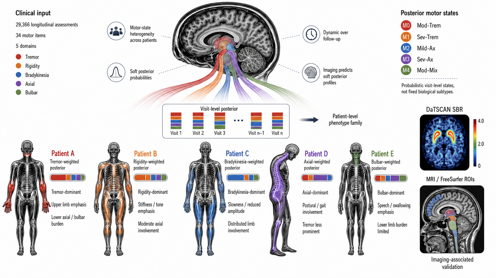
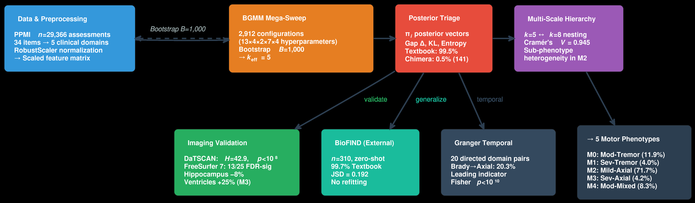
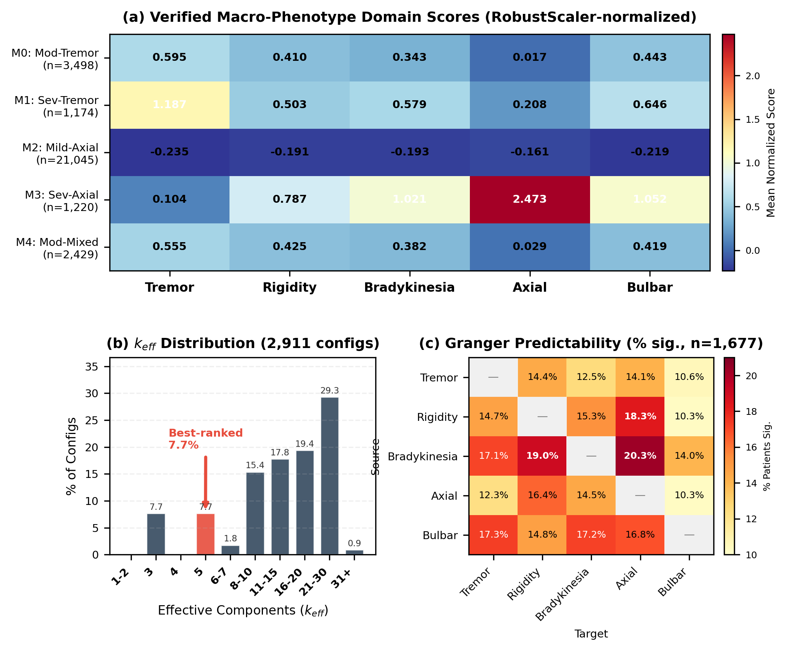
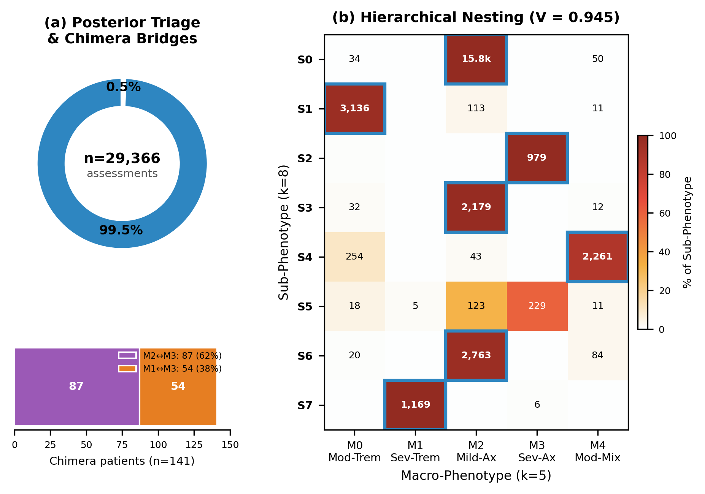
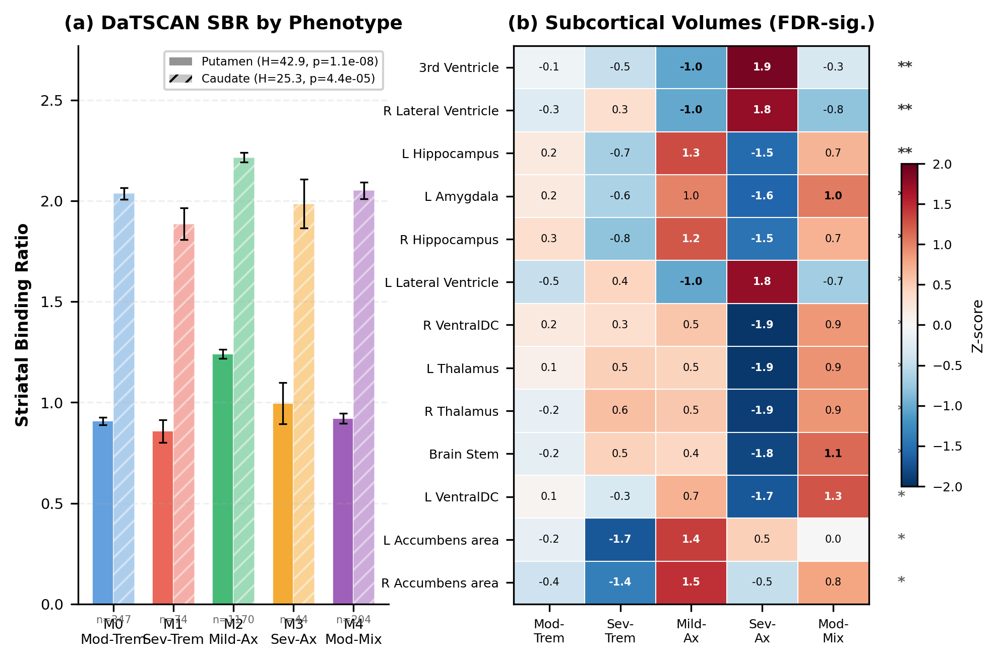
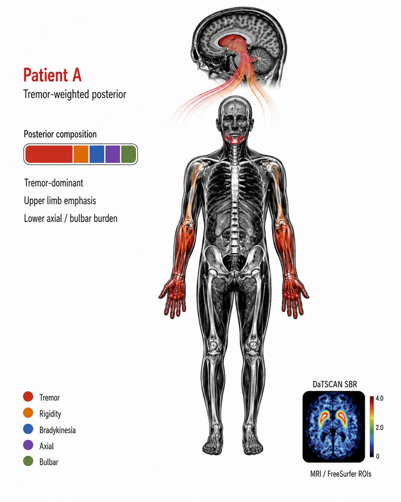
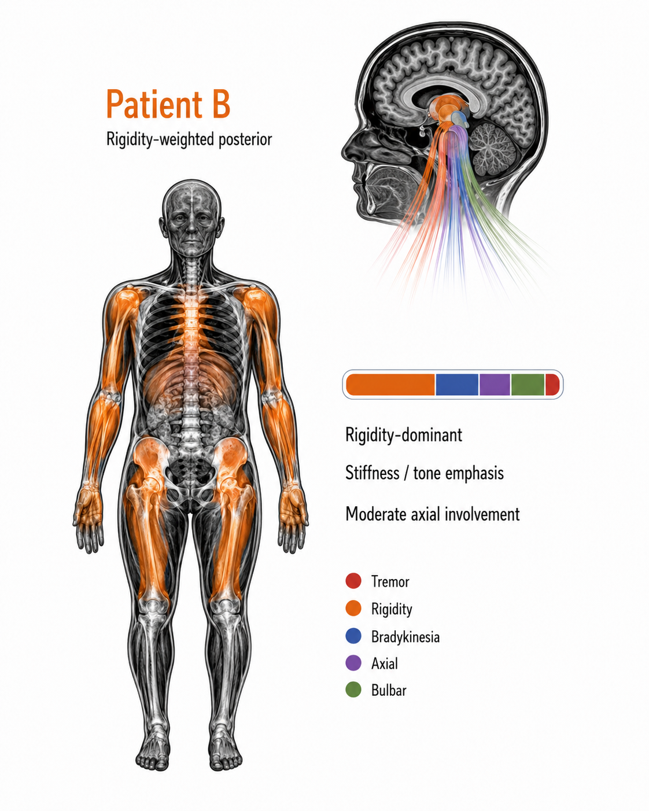
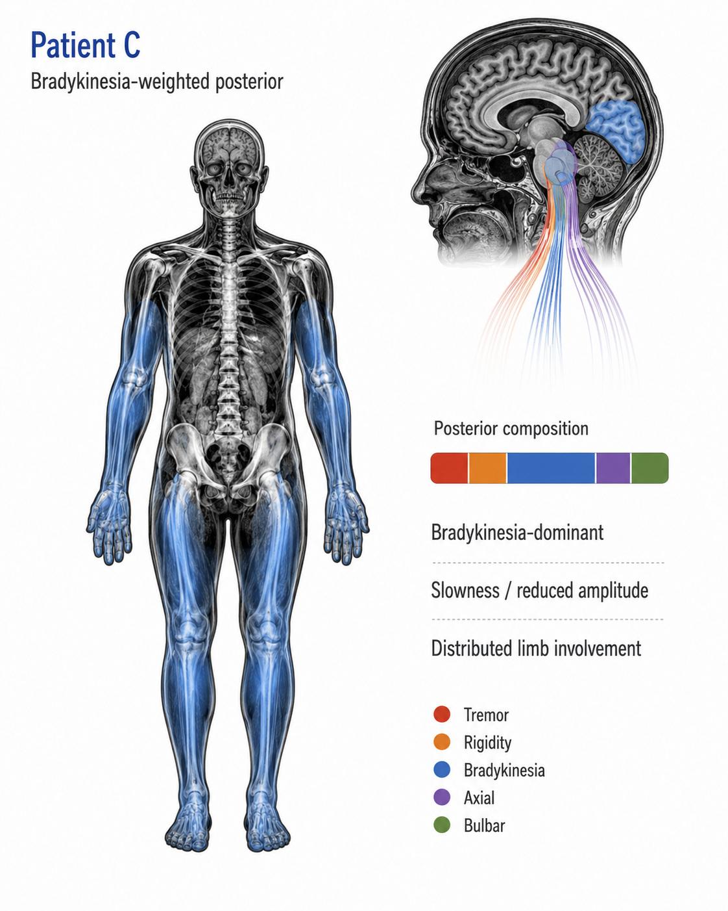
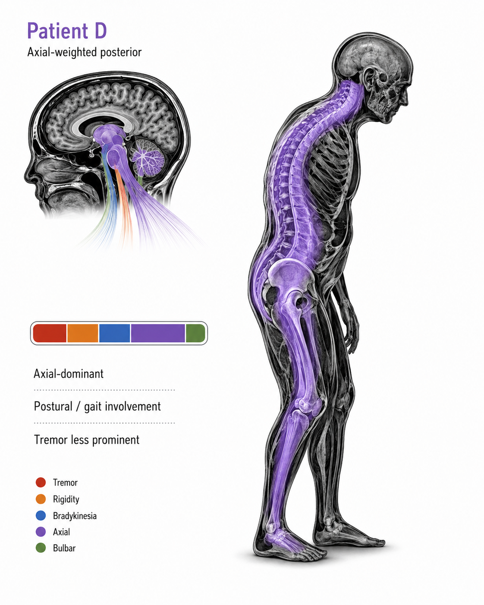
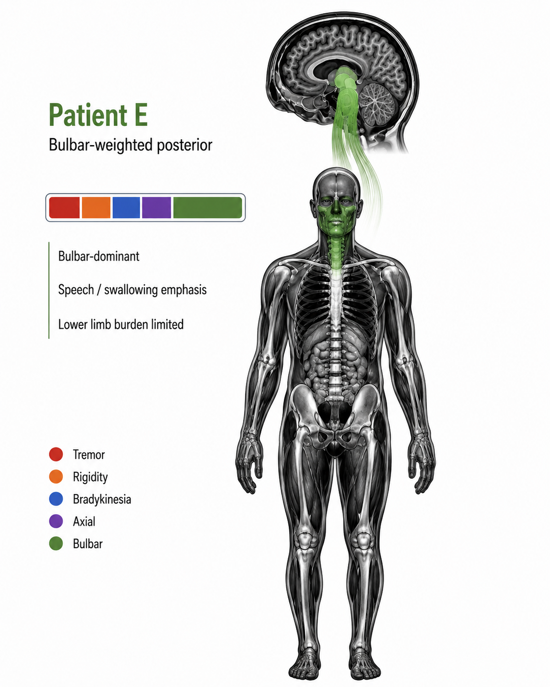

# Posterior-Aware Motor Phenotyping with Multimodal Imaging Validation in Parkinson's Disease

**Harsh Milind Tirhekar, Priyanshi Yadav, Chandrajit Bajaj**

Department of Computer Science, The University of Texas at Austin

Department of Biomedical Engineering, National Institute of Technology Raipur

Oden Institute for Computational Engineering and Sciences, The University of Texas at Austin

**bioRxiv 2026** &nbsp; | &nbsp; [Paper](https://doi.org/10.64898/2026.06.12.732003)

**MICCAI 2026 accepted paper** &nbsp; | &nbsp; [Interactive paper page](/projects/posterior-aware-pd-phenotyping-miccai/)

---



**Figure 1.** Posterior-aware motor-state phenotyping concept. Longitudinal MDS-UPDRS-III motor assessments are represented as soft posterior profiles over motor states, then interpreted through patient-level phenotype families and imaging-associated validation with DaTSCAN SBR and structural MRI / FreeSurfer ROIs.

---

### TL;DR

This work builds a posterior-aware Bayesian Gaussian mixture modeling framework for Parkinson's disease motor phenotyping. Instead of assigning each visit to a hard subtype, the model keeps the full posterior state vector, allowing high-confidence, boundary, and mixed motor-state presentations to be distinguished. The resulting five-state visit-level representation is then validated against DaTSCAN striatal binding ratios, FreeSurfer structural MRI volumes, and transfer to BioFIND without refitting.

---

### Why this matters

Two patients can have similar total MDS-UPDRS-III burden while expressing very different motor profiles. One may be tremor-weighted, another axial-weighted, and another mixed across rigidity, bradykinesia, axial, tremor, and bulbar domains. Hard subtype labels lose that uncertainty.

The paper's central point is that posterior probabilities are useful, not incidental. They identify visits that are clearly assigned, visits that sit near motor-state boundaries, and patient trajectories that can shift over follow-up. The imaging analyses then test whether these motor-state assignments have complementary biological correlates rather than treating the clusters as purely clinical artifacts.

---

### Framework

The study analyzes 29,366 longitudinal MDS-UPDRS-III assessments from 1,847 PPMI participants. The item-level motor exam is aggregated into five clinical domains: tremor, bradykinesia, rigidity, axial function, and bulbar symptoms.

A predefined Bayesian Gaussian mixture model search over 2,912 configurations selects a five-state representation. The framework uses model-conditioned posterior vectors to classify visits as high-confidence textbook assignments or intermediate-confidence chimera assignments. It also reconciles five-state and eight-state views through strong cross-granularity nesting.



**Figure 2.** Posterior-aware phenotyping pipeline from the paper: PPMI motor assessments are aggregated into five domains, a BGMM configuration search selects the motor-state representation, posterior triage flags uncertain assignments, k=5 and k=8 solutions are reconciled, and imaging validation is performed with DaTSCAN and FreeSurfer MRI.

---

### Motor-state heterogeneity

The selected five-state model includes moderate tremor, severe tremor, mild axial, severe axial, and moderate mixed motor-state families. Most assessments are high-confidence assignments, but the boundary cases are clinically important because they show where patient visits bridge state families rather than falling cleanly into one subtype.



**Figure 3.** Paper figure showing motor-domain separation, effective component behavior across the configuration sweep, and temporal predictability between motor domains.



**Figure 4.** Posterior triage and hierarchical nesting. High-confidence textbook assignments dominate, while chimera assignments concentrate near specific motor-state boundaries. The five-state and eight-state solutions show strong correspondence.

---

### Imaging validation

Motor-state assignments are associated with DaTSCAN striatal binding ratios in participants with matched imaging data, and with small-magnitude but significant FreeSurfer subcortical volume differences. The paper is careful about interpretation: these imaging results support complementary biological correlates, but they do not prove that the five states are fixed biological subtypes.



**Figure 5.** Multimodal imaging validation from the paper. DaTSCAN SBR differs across motor states, and FreeSurfer-normalized subcortical volumes show small but FDR-significant state-associated effects.

---

### Patient-level exemplars

The generated patient panels below illustrate how soft posterior profiles can map to different body-level motor expressions. These are concept figures, not individual clinical cases. Click any panel to open the full-size version.

|  |  |  |
| --------------------------------------------------------------------------------------------------------------------------- | ------------------------------------------------------------------------------------------------------------------------------- | --------------------------------------------------------------------------------------------------------------------------------------- |
| **Figure 6A.** Tremor-weighted posterior concept: upper-limb emphasis with lower axial and bulbar burden.                   | **Figure 6B.** Rigidity-weighted posterior concept: stiffness and tone emphasis with moderate axial involvement.                | **Figure 6C.** Bradykinesia-weighted posterior concept: slowness, reduced movement amplitude, and distributed limb involvement.         |

|  |  |
| ------------------------------------------------------------------------------------------------------------------------- | --------------------------------------------------------------------------------------------------------------------------- |
| **Figure 6D.** Axial-weighted posterior concept: postural and gait involvement with tremor less prominent.                | **Figure 6E.** Bulbar-weighted posterior concept: speech and swallowing emphasis with limited lower-limb burden.            |

**Figure 6.** Concept patient exemplars showing five different posterior-weighted motor-expression patterns.

---

### Key findings

- A systematic 2,912-configuration BGMM search selected an effective five-state motor representation.
- Posterior triage assigned 99.5% of assessments to high-confidence textbook categories and 0.5% to intermediate-confidence chimera categories.
- Cross-granularity nesting between five- and eight-state views was strong, with Cramer's V = 0.945.
- DaTSCAN SBR differed across motor states in the imaging-matched cohort, including putamen and caudate associations.
- FreeSurfer MRI validation found small-magnitude subcortical volume differences, with 13 of 25 ROIs FDR-significant.
- Applying the fixed scaler and BGMM to BioFIND without refitting yielded 99.7% high-confidence assignments.

---

### Interpretation and limits

The model should be read as a visit-level motor-state representation, not as proof of five stable biological patient subtypes. Repeated measures, possible severity confounding, and uncalibrated model posteriors limit the strength of causal or subtype claims. The value of the framework is that it makes assignment uncertainty visible while linking clinical motor-state structure to imaging-associated validation.

---

### Citation

```bibtex
@article{tirhekar2026posteriorcalibrated,
  title   = {Posterior-calibrated multimodal motor states reveal longitudinal and imaging-associated heterogeneity in Parkinson's disease},
  author  = {Tirhekar, H. M. and Yadav, P. and Bajaj, C.},
  journal = {bioRxiv},
  year    = {2026},
  doi     = {10.64898/2026.06.12.732003},
  url     = {https://doi.org/10.64898/2026.06.12.732003}
}
```
