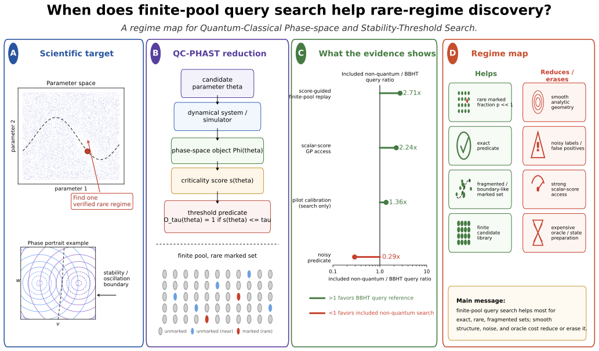
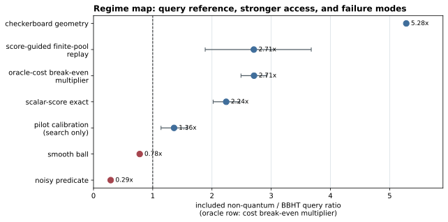
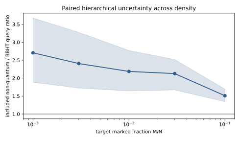
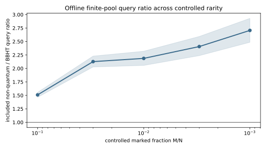
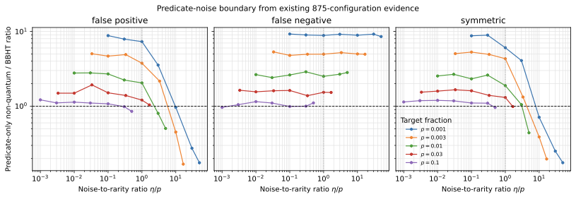
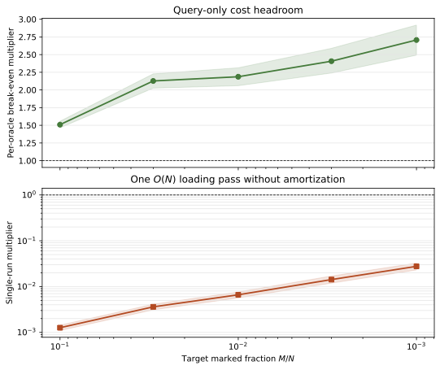
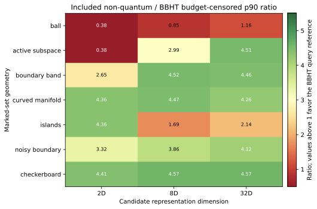
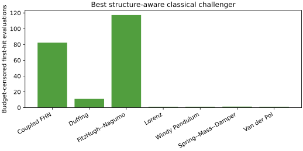

# QC-PHAST Search: Classical--Quantum Query Benchmarks for Finite-Pool Rare-Regime Discovery

**Harsh Milind Tirhekar<sup>1</sup>, Chandrajit Bajaj<sup>2</sup>**

<sup>1</sup>Department of Computer Science, College of Natural Sciences, The University of Texas at Austin<br />
<sup>2</sup>Department of Computer Science, Oden Institute for Computational Engineering and Sciences, The University of Texas at Austin

[Paper PDF](/papers/2607.21995v1.pdf) &nbsp; | &nbsp; [arXiv:2607.21995](https://arxiv.org/abs/2607.21995)


**QC-PHAST Search** studies when classical and quantum query-model comparisons are informative for discovering rare, scientifically meaningful regimes in finite candidate pools.

### Figures from the paper



_Regime map showing the scientific target, QC-PHAST reduction, evidence conditions, and failure modes for finite-pool query search._



_Included non-quantum versus BBHT query ratios across stronger access models and failure modes._



_Paired hierarchical uncertainty across target marked-set densities._



_Offline finite-pool query ratio across controlled target rarity._



_Predicate-only versus BBHT query ratios under false-positive, false-negative, and symmetric noise._



_Query-only cost headroom as oracle and state-preparation costs increase._



_Budget-censored p90 query ratios across marked-set geometries and candidate representation dimensions._



_Best structure-aware classical challenger across the benchmark dynamical systems._

### Overview

Rare-regime discovery is an active-search problem: find one verified parameter at which a scientifically defined qualitative threshold is crossed, even when acceptable candidates are rare, nonconvex, or fragmented. QC-PHAST (Quantum-Classical Phase-space and Stability-Threshold Search) provides an evidence-gated decision protocol and query-accounting framework for this setting.

The protocol separates the scientific object being searched from the query model used to search it. A candidate induces a dynamical object, a simulator-derived criticality score, and a verified first-hit predicate. Scientific metadata and pilot evidence then determine whether equation-aware search, scalar-score active search, predicate-only search, or only a query-model comparison is admissible.

### What the study contributes

- A regime map for deciding when a finite-pool marked-set comparison is scientifically defensible.
- Explicit accounting for simulator queries, calibration, false positives, predicate noise, state preparation, and classical structure.
- Boundary and geometry controls that test whether a query-model advantage survives contact with the underlying dynamical system.
- A resource-aware interpretation of the Grover/Boyer--Brassard--Hoyer--Tapp (BBHT) unknown-M reference.

The quantum row is an inherited BBHT marked-set query reference. The paper does not claim a new quantum-search theorem, a materialized circuit, or a hardware speedup.

### Experimental scope

The offline controlled sweep covers 875 configurations across seven canonical systems, five pool sizes, five target fractions, and five resampling seeds. Confirmation sweeps extend the base configurations across fixed thresholds, full charged-pilot calibration, continuous structure-aware routing, predicate noise, and learned-label accounting.

For the included non-quantum versus BBHT comparison at a marked fraction of 0.001, the exact finite-pool replay gives a point estimate of 2.71 for the classical-to-BBHT query ratio. Paired hierarchical resampling gives a mean ratio of 2.71 [1.89, 3.68] and a geometric mean of 2.39 [1.76, 3.31]. Under stronger scalar-score Gaussian-process access, the configuration-level ratio is 2.24 [2.02, 2.47], with BBHT favorable in 0.71 of configurations.

Noise, calibration, coherent-oracle, and structure-aware studies show how quickly a nominal query-model margin can disappear. A 5% noisy-predicate ablation gives 0.29 [0.27, 0.32], predicate-only replication gives 0.17 [0.15, 0.20], and coherent-oracle costs above roughly two to three classical score checks remove the total-cost headroom.

### Abstract

Rare-regime discovery in parameterized dynamical systems is an active-search problem: find one verified parameter at which a scientifically defined qualitative threshold is crossed, even when acceptable candidates are rare, nonconvex, or fragmented. We introduce Quantum-Classical Phase-space and Stability-Threshold Search (QC-PHAST), an evidence-gated decision protocol and query-accounting framework for finite candidate libraries.

A candidate induces a dynamical object, simulator-derived criticality score, and verified first-hit predicate. Scientific metadata and charged pilot evidence are used to assess whether equation-aware search, scalar-score active search, predicate-only search, or only a query-model comparison is admissible. The quantum row is the inherited Grover/Boyer--Brassard--Hoyer--Tapp (BBHT) unknown-M marked-set query reference; it is not a new quantum-search theorem, materialized circuit, or hardware-speedup claim.

The result is a regime map. Direct boundary constructions, geometry controls, online simulator loops, and learned-label accounting further identify when classical structure, false positives, calibration cost, or state preparation erases the query-model margin. QC-PHAST is therefore an auditable protocol for deciding when a finite-pool marked-set reference is informative and when classical or resource-aware search should dominate.

### Citation

```bibtex
@article{tirhekar2026qcphast,
  title   = {QC-PHAST Search: Classical--Quantum Query Benchmarks for Finite-Pool Rare-Regime Discovery},
  author  = {Tirhekar, Harsh Milind and Bajaj, Chandrajit},
  journal = {arXiv preprint arXiv:2607.21995},
  year    = {2026},
  url     = {https://arxiv.org/abs/2607.21995}
}
```
